# YT-RPC

rpc定义：远程过程调用，是一种计算机通信协议，允许程序在不同的计算机之间进行通信，像本地调用一样调用远程。

## 实现思路
基本设计，首先是需要有服务消费者和服务提供者两个角色：
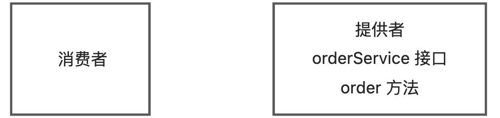


消费者想要调用提供者，就需要提供者启动一个web服务，然后通过请求客户端发送HTTP或者其他协议的请求来调用

比如请求 yt/order 地址之后就会调用 orderService 的 order 方法：

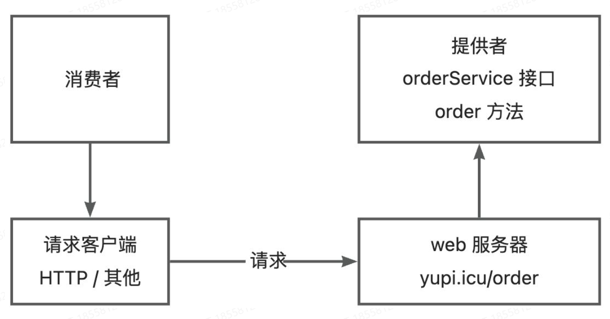

但是如果提供者提供了多个服务和方法，每个接口和方法都需要单独写一个接口，消费者对每个接口单独写一个HTTP调用的逻辑是不合适的

可以提供一个统一的服务调用接口，通过请求处理器，根据客户端的请求参数来进行不同的处理，调用不同的服务和方法

可以在服务提供者程序维护一个本地服务注册器，记录服务和对应实现类的映射

比如，消费者要调用orderService的order方法，可以发送一个请求，参数是 service=orderService.method=order，然后请求处理器会根据service从服务注册器中找到对应的服务实现类，并且通过Java的反射机制调用method指定的方法。

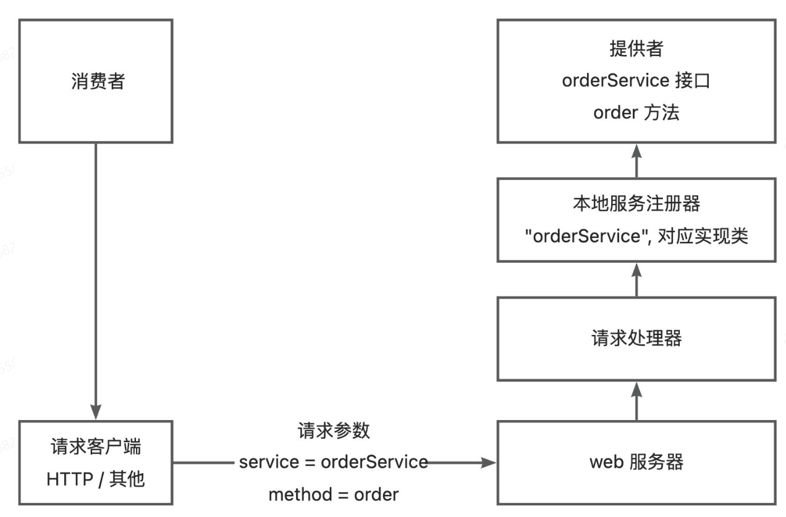

需要注意的是，由于Java对象无法直接在网络中传输，所以要对传输的参数进行序列化和反序列化。

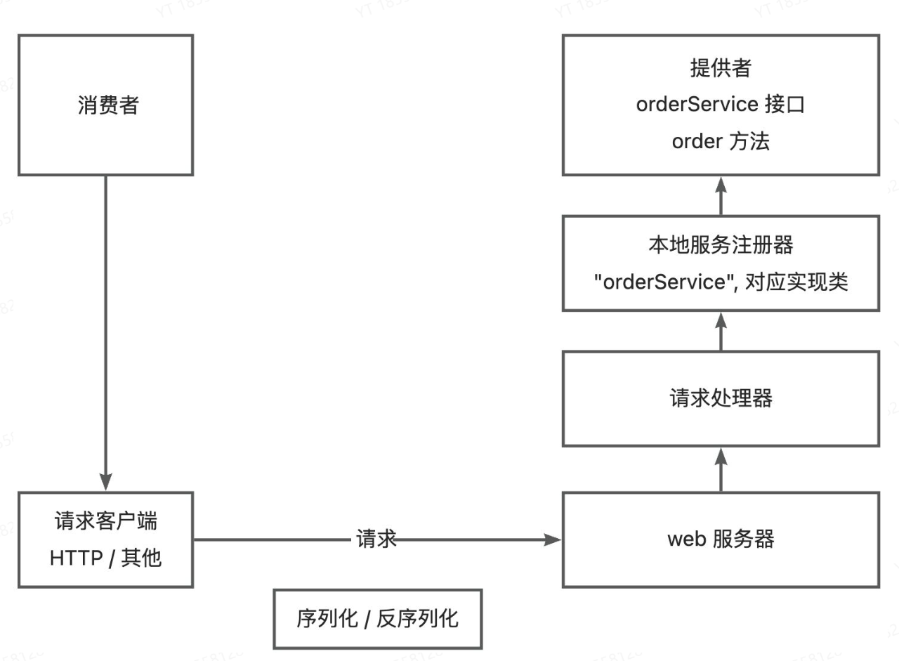为了简化消费者发请求的代码，实现类似本地调用的体验，可以基于代理模式，为消费者生成一个代理对象，由代理对象完成请求和响应的过程。

所谓代理，就是有人帮你做一些事情，不需要自己去做。

所以就能够绘制出一个简易的RPC框架图：

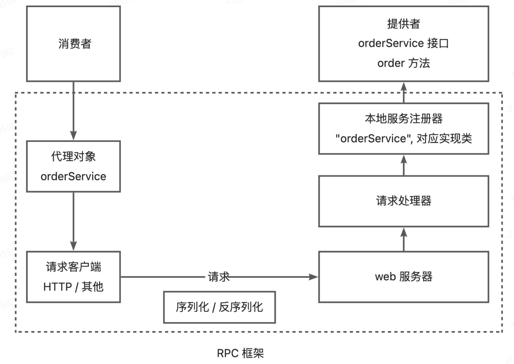

虚线部分就是RPC框架需要提供的模块和能力

### 拓展实现

#### 1. 服务注册发现

消费者如何知道提供者的调用地址？

需要一个注册中心，来保存服务提供者的地址，消费者要调用服务时，只需要从注册中心获取到服务提供者地址即可。

架构图：

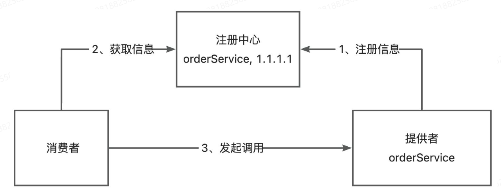

一般可以使用现成的第三方注册中心，比如Redis、Zookeeper即可。

#### 2. 负载均衡

如果有多个服务提供者，消费者应该调用哪个服务提供者呢

可以给服务调用方增加负载均衡的能力，通过指定不同的算法来决定调用哪一个服务提供者，比如轮询、随机、根据性能动态调用等。

架构图如下：

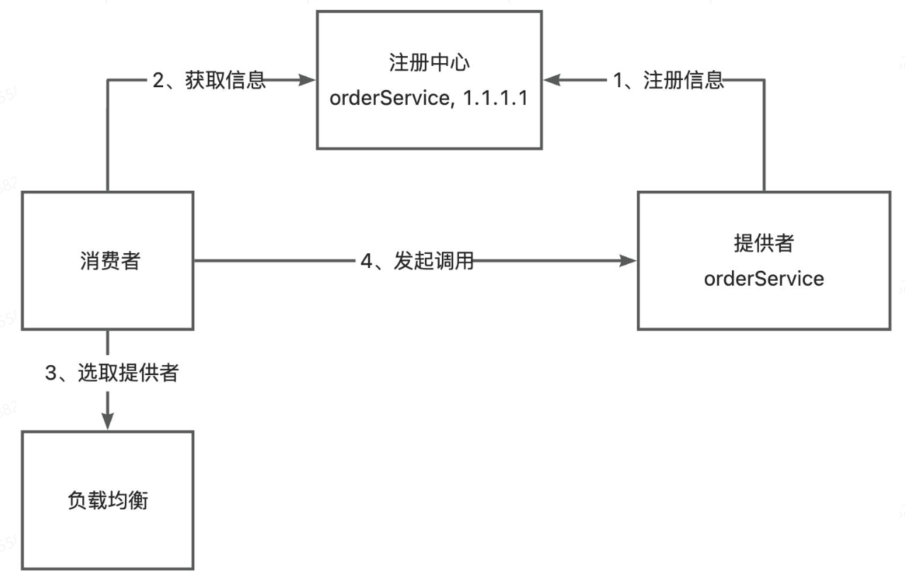

#### 3. 容错机制

如果服务调用失败应该如何处理，为了保证分布式系统的高可用，通常会给服务的调用增加一定的容错机制，比如失败重试，降级调用其他接口等。

架构图如下：

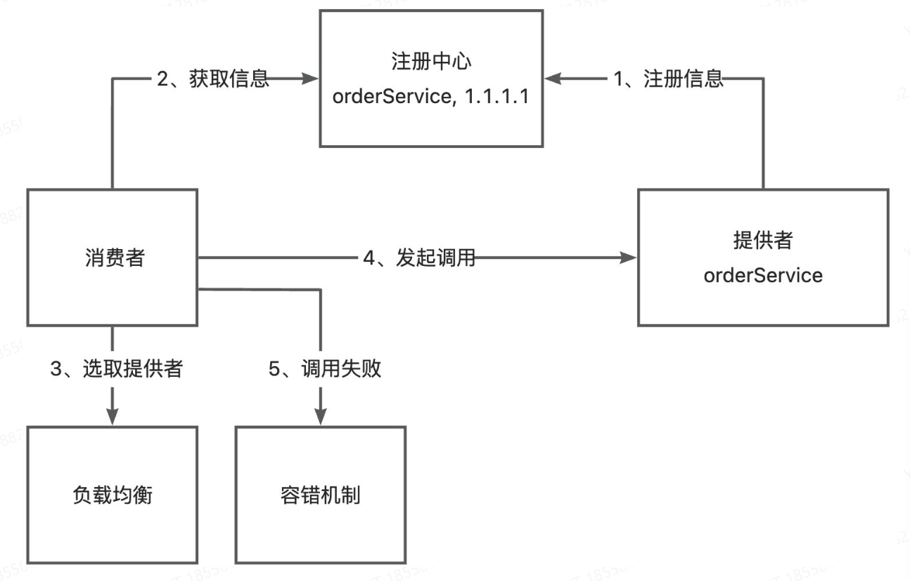


#### 4. 其他需要考虑的

1. 服务提供者下线了，需要一个接口剔除机制
2. 服务消费者每次都从注册中心拉取信息，性能可能较差，可以使用缓存来优化性能
3. 如何优化RPC框架的传输性能：选择合适的网络框架，自定义协议头，节约传输体积等
4. 如何让整个框架易于拓展，可以使用Java的SPI机制，配置化等

## 简易实现

架构图：


> 注意：不同的web服务器对应的请求处理方式也不相同，比如说Vert.x中是通过 `Handler<HttpServerRequest>` 接口来自定义请求处理器的，并且可以通过 request.bodyHandler 异步处理请求

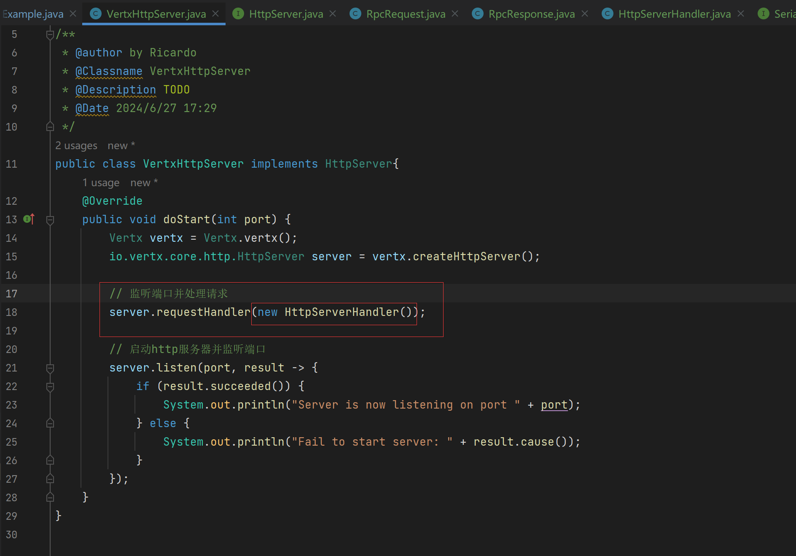

此处引入自定义的请求拦截器，这样就已经引入了RPC框架的服务提供者模块，已经能够接受请求并完成服务调用了。

然后是在消费方发起调用，调用这里可以使用代理实现的方式来进行调用，使用静态代理实现：

```java
package com.yt.example.consumer;

import cn.hutool.http.HttpRequest;
import cn.hutool.http.HttpResponse;
import com.yt.example.common.model.User;
import com.yt.example.common.service.UserService;
import com.yt.ytrpc.model.RpcRequest;
import com.yt.ytrpc.model.RpcResponse;
import com.yt.ytrpc.serializer.JdkSerializer;
import com.yt.ytrpc.serializer.Serializer;

import java.io.IOException;

public class UserServiceProxy implements UserService {
    @Override
    public User getUser(User user) {
        Serializer serializer = new JdkSerializer();

        // 发送请求
        RpcRequest rpcRequest = RpcRequest.builder()
                .serviceName(UserService.class.getName())
                .methodName("getUser")
                .parameterTypes(new Class[]{User.class})
                .args(new Object[]{user})
                .build();

        try {
            byte[] bodyBytes = serializer.serialize(rpcRequest);
            byte[] result;
            try (HttpResponse httpResponse = HttpRequest.post("http://localhost:8080")
                    .body(bodyBytes).execute();) {
                result = httpResponse.bodyBytes();
            }

            RpcResponse rpcResponse = serializer.deserialize(result, RpcResponse.class);

            return (User) rpcResponse.getData();
        } catch (IOException e) {
            e.printStackTrace();
        }
        return null;
    }
}
```

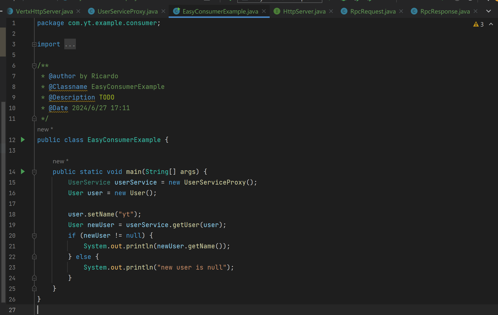

这里使用静态代理实现简单，容易实现，但是需要给每一个服务都单独写一个实现类，非常麻烦，灵活性差

所以一般在RPC框架中是使用动态代理：

动态代理的作用是根据要生成的对象的类型，自动生成一个代理对象

> 常用的动态代理实现方式有 JDK 动态代理和基于字节码生成的动态代理（比如 CGLIB）。前者简单易用、无需引入额外的库，但缺点是只能对接口进行代理；后者更灵活、可以对任何类进行代理，但性能略低于 JDK 动态代理。

创建一个服务代理类，继承 `InvocationHandler` 这个接口，这样在调用这个动态生成的类之后就会自动调用invoke方法：

```java
package com.yt.ytrpc.proxy;

import cn.hutool.http.HttpRequest;
import cn.hutool.http.HttpResponse;
import com.yt.ytrpc.model.RpcRequest;
import com.yt.ytrpc.model.RpcResponse;
import com.yt.ytrpc.serializer.JdkSerializer;
import com.yt.ytrpc.serializer.Serializer;

import java.io.IOException;
import java.lang.reflect.InvocationHandler;
import java.lang.reflect.Method;

/**
 * 服务代理（jdk动态代理）
 */
public class ServiceProxy implements InvocationHandler {
    @Override
    public Object invoke(Object proxy, Method method, Object[] args) throws Throwable {
        Serializer serializer = new JdkSerializer();

        // 构造请求
        RpcRequest rpcRequest = RpcRequest.builder()
                .serviceName(method.getDeclaringClass().getName())
                .methodName(method.getName())
                .parameterTypes(method.getParameterTypes()).args(args).build();

        try {
            byte[] bodyBytes = serializer.serialize(rpcRequest);

            try (HttpResponse httpResponse = HttpRequest.post("http://localhost:8088")
                    .body(bodyBytes).execute()) {
                byte[] result = httpResponse.bodyBytes();
                RpcResponse rpcResponse = serializer.deserialize(result, RpcResponse.class);
                return rpcResponse.getData();
            }
        } catch (IOException e) {
            e.printStackTrace();
        }
        return null;
    }
}
```

```java
package com.yt.example.consumer;

import com.yt.example.common.model.User;
import com.yt.example.common.service.UserService;
import com.yt.ytrpc.proxy.ServiceProxyFactory;

/**
 * @author by Ricardo
 * @Classname EasyConsumerExample
 * @Description 简单的消费者样例
 * @Date 2024/6/27 17:11
 */
public class EasyConsumerExample {

    public static void main(String[] args) {
        UserService userService = ServiceProxyFactory.getProxy(UserService.class);
        User user = new User();

        user.setName("yt");
        User newUser = userService.getUser(user);
        if (newUser != null) {
            System.out.println(newUser.getName());
        } else {
            System.out.println("new user is null");
        }
    }
}
```


## 提供全局配置加载

在RPC框架运行的过程中，会涉及到许多的配置信息，比如注册中心的地址，序列化方式，网络服务器端口等

> 之前的简易版 RPC 项目中，是在程序里硬编码了这些配置，不利于维护。

并且RPC框架是需要被其他项目作为服务提供者或者服务消费者引入的，我们应当允许引入框架的项目通过编写配置文件来自定义配置，并且一般情况下，服务提供者和服务消费者需要编写相同的RPC配置

因此，我们需要一套全局配置加载功能。能够让RPC框架轻松地从配置文件中读取配置，并且维护一个全局配置对象，便于框架快速获取到一致的配置

### 1. 设计方案

#### 配置项

先简单配置：

- name 名称
- version 版本号
- serverHost 服务器主机名
- serverPort 服务器端口号

后续随着框架功能的拓展，会不断增加配置项，还可以适当地对配置项进行分组

> 常见的RPC框架配置项：
>
> 1. 注册中心地址：服务提供者和服务消费者都需要指定注册中心的地址，以便进行服务的注册和发现。
> 2. 服务接口：服务提供者需要指定提供的服务接口，而服务消费者需要指定要调用的服务接口。
> 3. 序列化方式：服务提供者和服务消费者都需要指定序列化方式，以便在网络中传输数据时进行序列化和反序列化。
> 4. 网络通信协议：服务提供者和服务消费者都需要选择合适的网络通信协议，比如 TCP、HTTP 等。
> 5. 超时设置：服务提供者和服务消费者都需要设置超时时间，以便在调用服务时进行超时处理。
> 6. 负载均衡策略：服务消费者需要指定负载均衡策略，以决定调用哪个服务提供者实例。
> 7. 服务端线程模型：服务提供者需要指定服务端线程模型，以决定如何处理客户端请求。

可以参考Dubbo:

> [https://cn.dubbo.apache.org/zh-cn/overview/mannual/java-sdk/reference-manual/config/api/](https://cn.dubbo.apache.org/zh-cn/overview/mannual/java-sdk/reference-manual/config/api) 

#### 读取配置文件

如何读取配置文件，可以使用Java的 Properties  类自行编写，也可以使用一些第三方工具库

> https://doc.hutool.cn/pages/Props 

一般情况下，我们读取的配置文件名称为 `application.properties`，还可以通过指定文件名称后缀的方式来区分多环境，比如 `application-prod.properties` 表示生产环境、 `application-test.properties` 表示测试环境。

### 2. 开发实现

```java
package com.yt.ytrpccore.utils;

import cn.hutool.core.util.StrUtil;
import cn.hutool.setting.dialect.Props;

public class ConfigUtils {

    public static <T> T loadConfig(Class<T> tClass, String prefix) {
        return loadConfig(tClass, prefix, "");
    }


    /**
     * 根据环境加载配置
     * @param tClass
     * @param prefix
     * @param environment
     * @return
     * @param <T>
     */
    public static <T> T loadConfig(Class<T> tClass, String prefix, String environment) {
        StringBuilder configFileBuilder = new StringBuilder("application");

        if (StrUtil.isNotBlank(environment)) {
            configFileBuilder.append("-").append(environment);
        }
        configFileBuilder.append(".properties");
        Props props = new Props(configFileBuilder.toString());
        return props.toBean(tClass, prefix);
    }
}
```


## 序列化器与 SPI 机制

“更好的” 序列化器，可以是具有更高的性能、或者更小的序列化结果，这样就能够更快地完成 RPC 的请求和响应。

### 1. 动态使用序列化器

理想情况下，应该可以通过配置文件来指定使用的序列化器。在使用序列化器时，根据配置来获取不同的序列化器实例即可。

这个操作并不难，只需要定义一个 `序列化器名称 => 序列化器实现类对象` 的 Map，然后根据名称从 Map 中获取对象即可。

### 2. 自定义序列化器

如果开发者不想使用我们框架内置的序列化器，想要自己定义一个新的序列化器实现，但不能修改我们写好的框架代码，应该怎么办呢？

思路很简单：只要我们的 RPC 框架能够读取到用户自定义的类路径，然后加载这个类，作为 Serializer 序列化器接口的实现即可。这里就需要使用到 SPI 机制。

#### 什么是SPI

SPI（Service Provider Interface）服务提供接口是Java的机制，主要是用于实现模块化开发和插件化拓展。

SPI机制允许服务提供者通过特定的配置文件，将自己的实现注册到系统中，然后系统通过反射机制动态加载这些实现，而不需要修改原始框架代码，从而实现了系统的解耦，提高了可拓展性。

一个典型的 SPI 应用场景是 JDBC（Java 数据库连接库），不同的数据库驱动程序开发者可以使用 JDBC 库，然后定制自己的数据库驱动程序。

此外，主流 Java 开发框架中，几乎都使用到了 SPI 机制，比如 Servlet 容器、日志框架、ORM 框架、Spring 框架。**所以这是 Java 开发者必须掌握的一个重要特性！**

#### 如何实现SPI

分为系统实现和自定义实现：

##### 1. 系统实现

Java 内已经提供了 SPI 机制相关的 API 接口，可以直接使用，这种方式最简单。

1）首先在 `resources` 资源目录下创建 `META-INF/services` 目录，并且创建一个名称为要实现的接口的空文件。并且创建一个名称为要实现的接口的空文件。

2）在文件中填写自己定制的的接口实现类的完整类路径

如下：

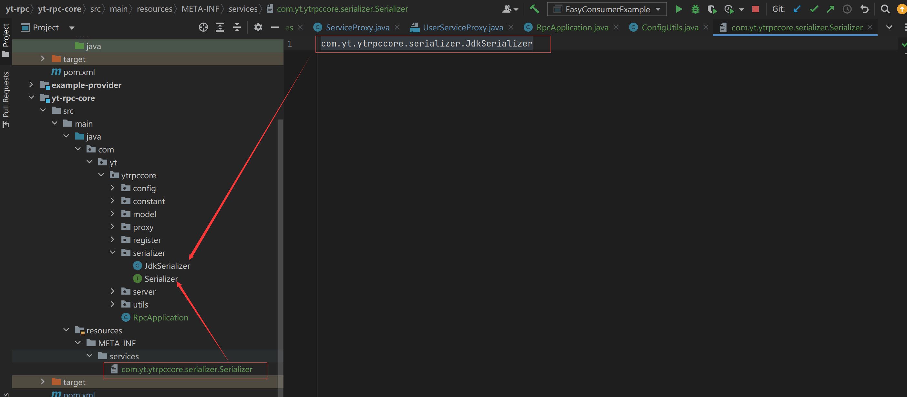

3）直接使用系统内置的ServiceLoader 动态加载指定接口的实现类，代码如下：

```java
// 指定序列化器
Serializer serializer = null;
ServiceLoader<Serializer> serviceLoader = ServiceLoader.load(Serializer.class);
for (Serializer service : serviceLoader) {
    serializer = service;
}
```

上面的代码能够获取到所有文件中编写的实现类对象，选择一个使用即可。

##### 2. 自定义SPI实现

系统实现SPI会简单，但是如果我们想定制多个不同的接口实现类，就没有办法在框架中指定使用哪一个了，也就无法实现**通过配置快速指定序列化器**的需求

所以需要自己自定义SPI机制的实现，只要能够根据配置加载到类即可

比如读取如下配置文件，能够得到一个 `序列化器名称 => 序列化器实现类对象` 的映射，之后就可以根据用户配置的序列化器名称动态加载指定实现类对象

系统配置序列化器：

```
jdk=com.yupi.yurpc.serializer.JdkSerializer
```

自定义的序列化器：

```
hessian=com.yupi.yurpc.serializer.HessianSerializer
json=com.yupi.yurpc.serializer.JsonSerializer
kryo=com.yupi.yurpc.serializer.KryoSerializer
```

按照这种格式进行编写：

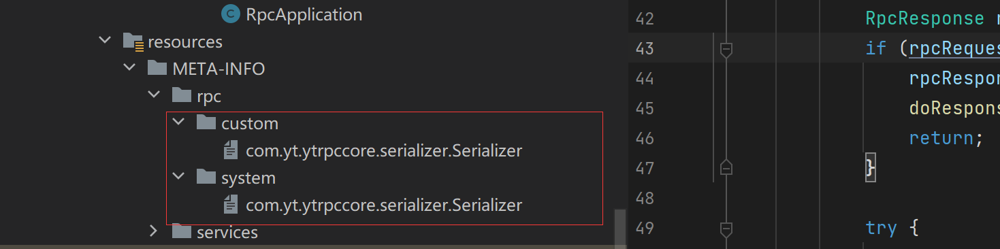

需要注意文件名需要是序列化文件器接口文件的路径。

#### 开发实现

分别实现 JSON、Kryo 和 Hessian 这三种主流的序列化器。

##### JSON：

```java
package com.yt.ytrpccore.serializer;

import com.fasterxml.jackson.databind.ObjectMapper;
import com.yt.ytrpccore.model.RpcRequest;
import com.yt.ytrpccore.model.RpcResponse;

import java.io.IOException;

/**
 * JSON序列化器
 */
public class JsonSerializer implements Serializer{

    private static final ObjectMapper OBJECT_MAPPER = new ObjectMapper();

    @Override
    public <T> byte[] serialize(T object) throws IOException {
        return OBJECT_MAPPER.writeValueAsBytes(object);
    }

    @Override
    public <T> T deserialize(byte[] bytes, Class<T> type) throws IOException {
        T t = OBJECT_MAPPER.readValue(bytes, type);
        if (t instanceof RpcRequest) {
            return handleRequest((RpcRequest) t, type);
        } else if (t instanceof RpcResponse) {
            return handleResponse((RpcResponse) t, type);
        }
        return null;
    }


    /**
     * 由于object的原始对象会被擦除，导致反序列化时会被作为LinkedHashMap无法转化为原始对象，所以这里需要做特殊处理
     * @param rpcRequest
     * @param type
     * @return
     * @param <T>
     * @throws IOException
     */
    private <T> T handleRequest(RpcRequest rpcRequest, Class<T> type) throws IOException {
        Class<?>[] parameterTypes = rpcRequest.getParameterTypes();
        Object[] args = rpcRequest.getArgs();

        // 循环处理每个参数的类型
        for (int i = 0; i < parameterTypes.length; i++) {
            Class<?> clazz = parameterTypes[i];
            // 如果类型不同就重新处理一下类型
            if (!clazz.isAssignableFrom(args[i].getClass())) {
                byte[] argBytes = OBJECT_MAPPER.writeValueAsBytes(args[i]);
                args[i] = OBJECT_MAPPER.readValue(argBytes, clazz);
            }
        }
        return type.cast(rpcRequest);
    }


    /**
     * Object的原始对象会被擦除，导致反序列化时会被作为 LinkedHashMap 无法转换成原始对象，所以这里需要拦截处理
     * @param rpcResponse
     * @param type
     * @return
     * @param <T>
     * @throws IOException
     */
    private <T> T handleResponse(RpcResponse rpcResponse, Class<T> type) throws IOException {
        byte[] dataBytes = OBJECT_MAPPER.writeValueAsBytes(rpcResponse.getData());
        rpcResponse.setData(OBJECT_MAPPER.readValue(dataBytes, rpcResponse.getDataType()));
        return type.cast(rpcResponse);
    }

}
```

##### Kryo 

```java
package com.yt.ytrpccore.serializer;

import com.esotericsoftware.kryo.Kryo;
import com.esotericsoftware.kryo.io.Input;
import com.esotericsoftware.kryo.io.Output;

import java.io.ByteArrayInputStream;
import java.io.ByteArrayOutputStream;
import java.io.IOException;

/**
 * Kryo 序列化器
 */
public class KryoSerializer implements Serializer{

    private static final ThreadLocal<Kryo> KRYO_THREAD_LOCAL = ThreadLocal.withInitial(() -> {
        Kryo kryo = new Kryo();
        // 设置动态序列化和反序列化，不提前注册所有类，防止出现安全问题
        kryo.setRegistrationRequired(false);
        return kryo;
    });


    @Override
    public <T> byte[] serialize(T object) {
        ByteArrayOutputStream byteArrayOutputStream = new ByteArrayOutputStream();
        Output output = new Output(byteArrayOutputStream);
        KRYO_THREAD_LOCAL.get().writeObject(output, object);
        output.close();
        return byteArrayOutputStream.toByteArray();
    }

    @Override
    public <T> T deserialize(byte[] bytes, Class<T> type) throws IOException {
        ByteArrayInputStream byteArrayOutputStream = new ByteArrayInputStream(bytes);
        Input input = new Input(byteArrayOutputStream);
        T result = KRYO_THREAD_LOCAL.get().readObject(input, type);
        input.close();
        return result;
    }
}
```

##### Hessian 

```java
package com.yt.ytrpccore.serializer;

import com.caucho.hessian.io.HessianInput;
import com.caucho.hessian.io.HessianOutput;

import java.io.ByteArrayInputStream;
import java.io.ByteArrayOutputStream;
import java.io.IOException;

public class HessianSerializer implements Serializer{
    @Override
    public <T> byte[] serialize(T object) throws IOException {
        ByteArrayOutputStream byteArrayOutputStream = new ByteArrayOutputStream();
        HessianOutput hessianOutput = new HessianOutput(byteArrayOutputStream);
        hessianOutput.writeObject(object);
        return byteArrayOutputStream.toByteArray();
    }

    @Override
    public <T> T deserialize(byte[] bytes, Class<T> type) throws IOException {
        ByteArrayInputStream byteArrayInputStream = new ByteArrayInputStream(bytes);
        HessianInput hessianInput = new HessianInput(byteArrayInputStream);
        return (T) hessianInput.readObject(type);
    }
}
```

编写一个SPI加载工具类（SpiLoader）：

```java
public static Map<String, Class<?>> load(Class<?> loadClass) {
    log.info("加载类型为 {} 的 SPI", loadClass.getName());
    // 扫描路径，用户自定义的SPI优先级要高于系统的SPI
    Map<String, Class<?>> keyClassMap = new HashMap<>();
    // META-INF/services/com.yt.ytrpccore.serializer.Serializer
    for (String scanDir : SCAN_DIRS) {
        List<URL> resources = ResourceUtil.getResources(scanDir + loadClass.getName());

        // 读取每个资源文件
        for (URL resource : resources) {
            try {
                InputStreamReader inputStreamReader = new InputStreamReader(resource.openStream());
                BufferedReader bufferedReader = new BufferedReader(inputStreamReader);
                String line = null;

                while ((line = bufferedReader.readLine()) != null) {
                    String[] strArray = line.split("=");
                    if (strArray.length > 1) {
                        String key = strArray[0];
                        String className = strArray[1];
                        // Class.forName(className) 根据类名找到对应的类
                        keyClassMap.put(key, Class.forName(className));
                    }
                }
            } catch (Exception e) {
                throw new RuntimeException(e);
            }
        }
    }
    loaderMap.put(loadClass.getName(), keyClassMap);
    return keyClassMap;
}
```

接收一个接口类型，然后通过MATA-INFO中的配置获取到他的对应实现类的位置。

这样就能在getInstance方法中获取到实现类的实例：

```java
public static <T> T getInstance(Class<?> tClass, String key) {
    String tClassName = tClass.getName();
    Map<String, Class<?>> keyClassMap = loaderMap.get(tClassName);
    if (keyClassMap == null) {
        throw new RuntimeException(String.format("SpiLoader 未加载 %s 类型", tClassName));
    }
    if (!keyClassMap.containsKey(key)) {
        throw new RuntimeException(String.format("SpiLoader 的 %s 不存在 key=%s 的类型", tClassName, key));
    }
    // 获取到要加载的实现类型
    Class<?> implClass = keyClassMap.get(key);
    // 从实例缓存中加载指定类型的实例
    String implClassName = implClass.getName();

    if (!instanceCache.containsKey(implClassName)) {
        try {
            instanceCache.put(implClassName, implClass.newInstance());
        } catch (InstantiationException | IllegalAccessException e) {
            String errorMsg = String.format("%s 类实例化失败", implClassName);
            throw new RuntimeException(errorMsg, e);
        }
    }
    return (T) instanceCache.get(implClassName);
}
```

配置rpc服务提供方中的请求拦截器中的序列化器来指定序列化方式，通过读取配置文件的方式：

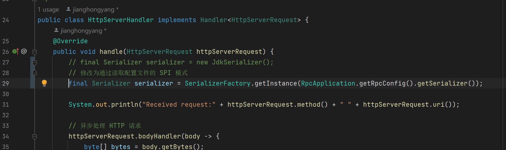

```java
final Serializer serializer = SerializerFactory.getInstance(RpcApplication.getRpcConfig().getSerializer());
```
