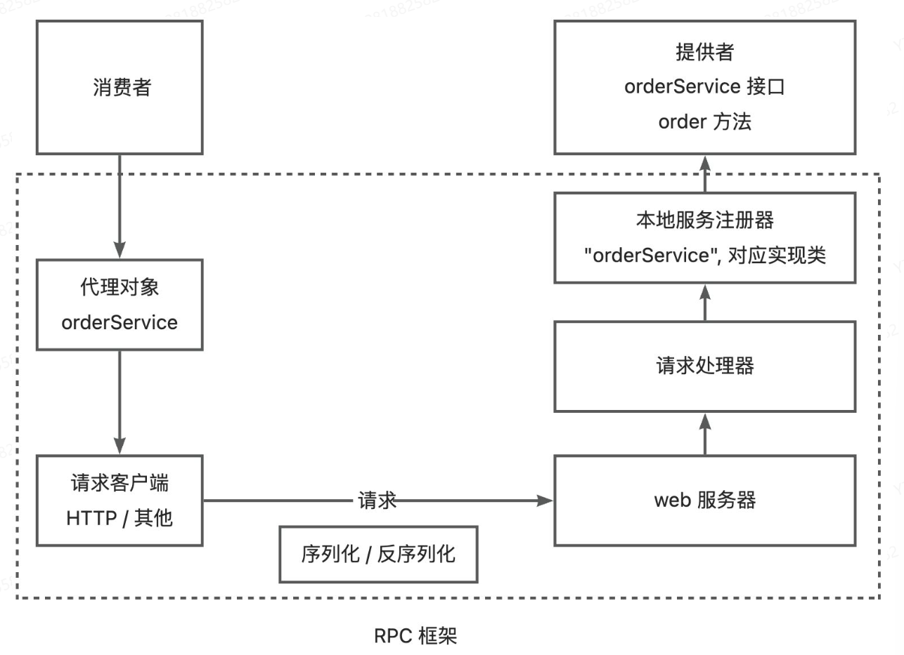

# YT-RPC

rpc定义：远程过程调用，是一种计算机通信协议，允许程序在不同的计算机之间进行通信，像本地调用一样调用远程。

## 实现思路
基本设计，首先是需要有服务消费者和服务提供者两个角色：


消费者想要调用提供者，就需要提供者启动一个web服务，然后通过请求客户端发送HTTP或者其他协议的请求来调用

比如请求 yt/order 地址之后就会调用 orderService 的 order 方法：


但是如果提供者提供了多个服务和方法，每个接口和方法都需要单独写一个接口，消费者对每个接口单独写一个HTTP调用的逻辑是不合适的

可以提供一个统一的服务调用接口，通过请求处理器，根据客户端的请求参数来进行不同的处理，调用不同的服务和方法

可以在服务提供者程序维护一个本地服务注册器，记录服务和对应实现类的映射

比如，消费者要调用orderService的order方法，可以发送一个请求，参数是 service=orderService.method=order，然后请求处理器会根据service从服务注册器中找到对应的服务实现类，并且通过Java的反射机制调用method指定的方法。


需要注意的是，由于Java对象无法直接在网络中传输，所以要对传输的参数进行序列化和反序列化。

为了简化消费者发请求的代码，实现类似本地调用的体验，可以基于代理模式，为消费者生成一个代理对象，由代理对象完成请求和响应的过程。

所谓代理，就是有人帮你做一些事情，不需要自己去做。

所以就能够绘制出一个简易的RPC框架图：


虚线部分就是RPC框架需要提供的模块和能力

### 拓展实现

#### 1. 服务注册发现

消费者如何知道提供者的调用地址？

需要一个注册中心，来保存服务提供者的地址，消费者要调用服务时，只需要从注册中心获取到服务提供者地址即可。

架构图：


一般可以使用现成的第三方注册中心，比如Redis、Zookeeper即可。

#### 2. 负载均衡

如果有多个服务提供者，消费者应该调用哪个服务提供者呢

可以给服务调用方增加负载均衡的能力，通过指定不同的算法来决定调用哪一个服务提供者，比如轮询、随机、根据性能动态调用等。

架构图如下：


#### 3. 容错机制

如果服务调用失败应该如何处理，为了保证分布式系统的高可用，通常会给服务的调用增加一定的容错机制，比如失败重试，降级调用其他接口等。

架构图如下：


#### 4. 其他需要考虑的

1. 服务提供者下线了，需要一个接口剔除机制
2. 服务消费者每次都从注册中心拉取信息，性能可能较差，可以使用缓存来优化性能
3. 如何优化RPC框架的传输性能：选择合适的网络框架，自定义协议头，节约传输体积等
4. 如何让整个框架易于拓展，可以使用Java的SPI机制，配置化等

## 简易实现

架构图：



> 注意：不同的web服务器对应的请求处理方式也不相同，比如说Vert.x中是通过 `Handler<HttpServerRequest>` 接口来自定义请求处理器的，并且可以通过 request.bodyHandler 异步处理请求


此处引入自定义的请求拦截器，这样就已经引入了RPC框架的服务提供者模块，已经能够接受请求并完成服务调用了。

然后是在消费方发起调用，调用这里可以使用代理实现的方式来进行调用，使用静态代理实现：

```java
package com.yt.example.consumer;

import cn.hutool.http.HttpRequest;
import cn.hutool.http.HttpResponse;
import com.yt.example.common.model.User;
import com.yt.example.common.service.UserService;
import com.yt.ytrpc.model.RpcRequest;
import com.yt.ytrpc.model.RpcResponse;
import com.yt.ytrpc.serializer.JdkSerializer;
import com.yt.ytrpc.serializer.Serializer;

import java.io.IOException;

public class UserServiceProxy implements UserService {
    @Override
    public User getUser(User user) {
        Serializer serializer = new JdkSerializer();

        // 发送请求
        RpcRequest rpcRequest = RpcRequest.builder()
                .serviceName(UserService.class.getName())
                .methodName("getUser")
                .parameterTypes(new Class[]{User.class})
                .args(new Object[]{user})
                .build();

        try {
            byte[] bodyBytes = serializer.serialize(rpcRequest);
            byte[] result;
            try (HttpResponse httpResponse = HttpRequest.post("http://localhost:8080")
                    .body(bodyBytes).execute();) {
                result = httpResponse.bodyBytes();
            }

            RpcResponse rpcResponse = serializer.deserialize(result, RpcResponse.class);

            return (User) rpcResponse.getData();
        } catch (IOException e) {
            e.printStackTrace();
        }
        return null;
    }
}
```


这里使用静态代理实现简单，容易实现，但是需要给每一个服务都单独写一个实现类，非常麻烦，灵活性差

所以一般在RPC框架中是使用动态代理：

动态代理的作用是根据要生成的对象的类型，自动生成一个代理对象

> 常用的动态代理实现方式有 JDK 动态代理和基于字节码生成的动态代理（比如 CGLIB）。前者简单易用、无需引入额外的库，但缺点是只能对接口进行代理；后者更灵活、可以对任何类进行代理，但性能略低于 JDK 动态代理。

创建一个服务代理类，继承 `InvocationHandler` 这个接口，这样在调用这个动态生成的类之后就会自动调用invoke方法：

```java
package com.yt.ytrpc.proxy;

import cn.hutool.http.HttpRequest;
import cn.hutool.http.HttpResponse;
import com.yt.ytrpc.model.RpcRequest;
import com.yt.ytrpc.model.RpcResponse;
import com.yt.ytrpc.serializer.JdkSerializer;
import com.yt.ytrpc.serializer.Serializer;

import java.io.IOException;
import java.lang.reflect.InvocationHandler;
import java.lang.reflect.Method;

/**
 * 服务代理（jdk动态代理）
 */
public class ServiceProxy implements InvocationHandler {
    @Override
    public Object invoke(Object proxy, Method method, Object[] args) throws Throwable {
        Serializer serializer = new JdkSerializer();

        // 构造请求
        RpcRequest rpcRequest = RpcRequest.builder()
                .serviceName(method.getDeclaringClass().getName())
                .methodName(method.getName())
                .parameterTypes(method.getParameterTypes()).args(args).build();

        try {
            byte[] bodyBytes = serializer.serialize(rpcRequest);

            try (HttpResponse httpResponse = HttpRequest.post("http://localhost:8088")
                    .body(bodyBytes).execute()) {
                byte[] result = httpResponse.bodyBytes();
                RpcResponse rpcResponse = serializer.deserialize(result, RpcResponse.class);
                return rpcResponse.getData();
            }
        } catch (IOException e) {
            e.printStackTrace();
        }
        return null;
    }
}
```

```java
package com.yt.example.consumer;

import com.yt.example.common.model.User;
import com.yt.example.common.service.UserService;
import com.yt.ytrpc.proxy.ServiceProxyFactory;

/**
 * @author by Ricardo
 * @Classname EasyConsumerExample
 * @Description 简单的消费者样例
 * @Date 2024/6/27 17:11
 */
public class EasyConsumerExample {

    public static void main(String[] args) {
        UserService userService = ServiceProxyFactory.getProxy(UserService.class);
        User user = new User();

        user.setName("yt");
        User newUser = userService.getUser(user);
        if (newUser != null) {
            System.out.println(newUser.getName());
        } else {
            System.out.println("new user is null");
        }
    }
}
```


## 提供全局配置加载

在RPC框架运行的过程中，会涉及到许多的配置信息，比如注册中心的地址，序列化方式，网络服务器端口等

> 之前的简易版 RPC 项目中，是在程序里硬编码了这些配置，不利于维护。

并且RPC框架是需要被其他项目作为服务提供者或者服务消费者引入的，我们应当允许引入框架的项目通过编写配置文件来自定义配置，并且一般情况下，服务提供者和服务消费者需要编写相同的RPC配置

因此，我们需要一套全局配置加载功能。能够让RPC框架轻松地从配置文件中读取配置，并且维护一个全局配置对象，便于框架快速获取到一致的配置

### 1. 设计方案

#### 配置项

先简单配置：

- name 名称
- version 版本号
- serverHost 服务器主机名
- serverPort 服务器端口号

后续随着框架功能的拓展，会不断增加配置项，还可以适当地对配置项进行分组

> 常见的RPC框架配置项：
>
> 1. 注册中心地址：服务提供者和服务消费者都需要指定注册中心的地址，以便进行服务的注册和发现。
> 2. 服务接口：服务提供者需要指定提供的服务接口，而服务消费者需要指定要调用的服务接口。
> 3. 序列化方式：服务提供者和服务消费者都需要指定序列化方式，以便在网络中传输数据时进行序列化和反序列化。
> 4. 网络通信协议：服务提供者和服务消费者都需要选择合适的网络通信协议，比如 TCP、HTTP 等。
> 5. 超时设置：服务提供者和服务消费者都需要设置超时时间，以便在调用服务时进行超时处理。
> 6. 负载均衡策略：服务消费者需要指定负载均衡策略，以决定调用哪个服务提供者实例。
> 7. 服务端线程模型：服务提供者需要指定服务端线程模型，以决定如何处理客户端请求。

可以参考Dubbo:

> [https://cn.dubbo.apache.org/zh-cn/overview/mannual/java-sdk/reference-manual/config/api/](https://cn.dubbo.apache.org/zh-cn/overview/mannual/java-sdk/reference-manual/config/api) 

#### 读取配置文件

如何读取配置文件，可以使用Java的 Properties  类自行编写，也可以使用一些第三方工具库

> https://doc.hutool.cn/pages/Props 

一般情况下，我们读取的配置文件名称为 `application.properties`，还可以通过指定文件名称后缀的方式来区分多环境，比如 `application-prod.properties` 表示生产环境、 `application-test.properties` 表示测试环境。

### 2. 开发实现

```java
package com.yt.ytrpccore.utils;

import cn.hutool.core.util.StrUtil;
import cn.hutool.setting.dialect.Props;

public class ConfigUtils {

    public static <T> T loadConfig(Class<T> tClass, String prefix) {
        return loadConfig(tClass, prefix, "");
    }


    /**
     * 根据环境加载配置
     * @param tClass
     * @param prefix
     * @param environment
     * @return
     * @param <T>
     */
    public static <T> T loadConfig(Class<T> tClass, String prefix, String environment) {
        StringBuilder configFileBuilder = new StringBuilder("application");

        if (StrUtil.isNotBlank(environment)) {
            configFileBuilder.append("-").append(environment);
        }
        configFileBuilder.append(".properties");
        Props props = new Props(configFileBuilder.toString());
        return props.toBean(tClass, prefix);
    }
}
```


## 序列化器与 SPI 机制

“更好的” 序列化器，可以是具有更高的性能、或者更小的序列化结果，这样就能够更快地完成 RPC 的请求和响应。

### 1. 动态使用序列化器

理想情况下，应该可以通过配置文件来指定使用的序列化器。在使用序列化器时，根据配置来获取不同的序列化器实例即可。

这个操作并不难，只需要定义一个 `序列化器名称 => 序列化器实现类对象` 的 Map，然后根据名称从 Map 中获取对象即可。

### 2. 自定义序列化器

如果开发者不想使用我们框架内置的序列化器，想要自己定义一个新的序列化器实现，但不能修改我们写好的框架代码，应该怎么办呢？

思路很简单：只要我们的 RPC 框架能够读取到用户自定义的类路径，然后加载这个类，作为 Serializer 序列化器接口的实现即可。这里就需要使用到 SPI 机制。

#### 什么是SPI

SPI（Service Provider Interface）服务提供接口是Java的机制，主要是用于实现模块化开发和插件化拓展。

SPI机制允许服务提供者通过特定的配置文件，将自己的实现注册到系统中，然后系统通过反射机制动态加载这些实现，而不需要修改原始框架代码，从而实现了系统的解耦，提高了可拓展性。

一个典型的 SPI 应用场景是 JDBC（Java 数据库连接库），不同的数据库驱动程序开发者可以使用 JDBC 库，然后定制自己的数据库驱动程序。

此外，主流 Java 开发框架中，几乎都使用到了 SPI 机制，比如 Servlet 容器、日志框架、ORM 框架、Spring 框架。**所以这是 Java 开发者必须掌握的一个重要特性！**

#### 如何实现SPI

分为系统实现和自定义实现：

##### 1. 系统实现

Java 内已经提供了 SPI 机制相关的 API 接口，可以直接使用，这种方式最简单。

1）首先在 `resources` 资源目录下创建 `META-INF/services` 目录，并且创建一个名称为要实现的接口的空文件。并且创建一个名称为要实现的接口的空文件。

2）在文件中填写自己定制的的接口实现类的完整类路径

如下：


3）直接使用系统内置的ServiceLoader 动态加载指定接口的实现类，代码如下：

```java
// 指定序列化器
Serializer serializer = null;
ServiceLoader<Serializer> serviceLoader = ServiceLoader.load(Serializer.class);
for (Serializer service : serviceLoader) {
    serializer = service;
}
```

上面的代码能够获取到所有文件中编写的实现类对象，选择一个使用即可。

##### 2. 自定义SPI实现

系统实现SPI会简单，但是如果我们想定制多个不同的接口实现类，就没有办法在框架中指定使用哪一个了，也就无法实现**通过配置快速指定序列化器**的需求

所以需要自己自定义SPI机制的实现，只要能够根据配置加载到类即可

比如读取如下配置文件，能够得到一个 `序列化器名称 => 序列化器实现类对象` 的映射，之后就可以根据用户配置的序列化器名称动态加载指定实现类对象

系统配置序列化器：

```
jdk=com.yupi.yurpc.serializer.JdkSerializer
```

自定义的序列化器：

```
hessian=com.yupi.yurpc.serializer.HessianSerializer
json=com.yupi.yurpc.serializer.JsonSerializer
kryo=com.yupi.yurpc.serializer.KryoSerializer
```

按照这种格式进行编写：


需要注意文件名需要是序列化文件器接口文件的路径。

#### 开发实现

分别实现 JSON、Kryo 和 Hessian 这三种主流的序列化器。

##### JSON：

```java
package com.yt.ytrpccore.serializer;

import com.fasterxml.jackson.databind.ObjectMapper;
import com.yt.ytrpccore.model.RpcRequest;
import com.yt.ytrpccore.model.RpcResponse;

import java.io.IOException;

/**
 * JSON序列化器
 */
public class JsonSerializer implements Serializer{

    private static final ObjectMapper OBJECT_MAPPER = new ObjectMapper();

    @Override
    public <T> byte[] serialize(T object) throws IOException {
        return OBJECT_MAPPER.writeValueAsBytes(object);
    }

    @Override
    public <T> T deserialize(byte[] bytes, Class<T> type) throws IOException {
        T t = OBJECT_MAPPER.readValue(bytes, type);
        if (t instanceof RpcRequest) {
            return handleRequest((RpcRequest) t, type);
        } else if (t instanceof RpcResponse) {
            return handleResponse((RpcResponse) t, type);
        }
        return null;
    }


    /**
     * 由于object的原始对象会被擦除，导致反序列化时会被作为LinkedHashMap无法转化为原始对象，所以这里需要做特殊处理
     * @param rpcRequest
     * @param type
     * @return
     * @param <T>
     * @throws IOException
     */
    private <T> T handleRequest(RpcRequest rpcRequest, Class<T> type) throws IOException {
        Class<?>[] parameterTypes = rpcRequest.getParameterTypes();
        Object[] args = rpcRequest.getArgs();

        // 循环处理每个参数的类型
        for (int i = 0; i < parameterTypes.length; i++) {
            Class<?> clazz = parameterTypes[i];
            // 如果类型不同就重新处理一下类型
            if (!clazz.isAssignableFrom(args[i].getClass())) {
                byte[] argBytes = OBJECT_MAPPER.writeValueAsBytes(args[i]);
                args[i] = OBJECT_MAPPER.readValue(argBytes, clazz);
            }
        }
        return type.cast(rpcRequest);
    }


    /**
     * Object的原始对象会被擦除，导致反序列化时会被作为 LinkedHashMap 无法转换成原始对象，所以这里需要拦截处理
     * @param rpcResponse
     * @param type
     * @return
     * @param <T>
     * @throws IOException
     */
    private <T> T handleResponse(RpcResponse rpcResponse, Class<T> type) throws IOException {
        byte[] dataBytes = OBJECT_MAPPER.writeValueAsBytes(rpcResponse.getData());
        rpcResponse.setData(OBJECT_MAPPER.readValue(dataBytes, rpcResponse.getDataType()));
        return type.cast(rpcResponse);
    }

}
```

##### Kryo 

```java
package com.yt.ytrpccore.serializer;

import com.esotericsoftware.kryo.Kryo;
import com.esotericsoftware.kryo.io.Input;
import com.esotericsoftware.kryo.io.Output;

import java.io.ByteArrayInputStream;
import java.io.ByteArrayOutputStream;
import java.io.IOException;

/**
 * Kryo 序列化器
 */
public class KryoSerializer implements Serializer{

    private static final ThreadLocal<Kryo> KRYO_THREAD_LOCAL = ThreadLocal.withInitial(() -> {
        Kryo kryo = new Kryo();
        // 设置动态序列化和反序列化，不提前注册所有类，防止出现安全问题
        kryo.setRegistrationRequired(false);
        return kryo;
    });


    @Override
    public <T> byte[] serialize(T object) {
        ByteArrayOutputStream byteArrayOutputStream = new ByteArrayOutputStream();
        Output output = new Output(byteArrayOutputStream);
        KRYO_THREAD_LOCAL.get().writeObject(output, object);
        output.close();
        return byteArrayOutputStream.toByteArray();
    }

    @Override
    public <T> T deserialize(byte[] bytes, Class<T> type) throws IOException {
        ByteArrayInputStream byteArrayOutputStream = new ByteArrayInputStream(bytes);
        Input input = new Input(byteArrayOutputStream);
        T result = KRYO_THREAD_LOCAL.get().readObject(input, type);
        input.close();
        return result;
    }
}
```

##### Hessian 

```java
package com.yt.ytrpccore.serializer;

import com.caucho.hessian.io.HessianInput;
import com.caucho.hessian.io.HessianOutput;

import java.io.ByteArrayInputStream;
import java.io.ByteArrayOutputStream;
import java.io.IOException;

public class HessianSerializer implements Serializer{
    @Override
    public <T> byte[] serialize(T object) throws IOException {
        ByteArrayOutputStream byteArrayOutputStream = new ByteArrayOutputStream();
        HessianOutput hessianOutput = new HessianOutput(byteArrayOutputStream);
        hessianOutput.writeObject(object);
        return byteArrayOutputStream.toByteArray();
    }

    @Override
    public <T> T deserialize(byte[] bytes, Class<T> type) throws IOException {
        ByteArrayInputStream byteArrayInputStream = new ByteArrayInputStream(bytes);
        HessianInput hessianInput = new HessianInput(byteArrayInputStream);
        return (T) hessianInput.readObject(type);
    }
}
```

编写一个SPI加载工具类（SpiLoader）：

```java
public static Map<String, Class<?>> load(Class<?> loadClass) {
    log.info("加载类型为 {} 的 SPI", loadClass.getName());
    // 扫描路径，用户自定义的SPI优先级要高于系统的SPI
    Map<String, Class<?>> keyClassMap = new HashMap<>();
    // META-INF/services/com.yt.ytrpccore.serializer.Serializer
    for (String scanDir : SCAN_DIRS) {
        List<URL> resources = ResourceUtil.getResources(scanDir + loadClass.getName());

        // 读取每个资源文件
        for (URL resource : resources) {
            try {
                InputStreamReader inputStreamReader = new InputStreamReader(resource.openStream());
                BufferedReader bufferedReader = new BufferedReader(inputStreamReader);
                String line = null;

                while ((line = bufferedReader.readLine()) != null) {
                    String[] strArray = line.split("=");
                    if (strArray.length > 1) {
                        String key = strArray[0];
                        String className = strArray[1];
                        // Class.forName(className) 根据类名找到对应的类
                        keyClassMap.put(key, Class.forName(className));
                    }
                }
            } catch (Exception e) {
                throw new RuntimeException(e);
            }
        }
    }
    loaderMap.put(loadClass.getName(), keyClassMap);
    return keyClassMap;
}
```

接收一个接口类型，然后通过MATA-INFO中的配置获取到他的对应实现类的位置。

这样就能在getInstance方法中获取到实现类的实例：

```java
public static <T> T getInstance(Class<?> tClass, String key) {
    String tClassName = tClass.getName();
    Map<String, Class<?>> keyClassMap = loaderMap.get(tClassName);
    if (keyClassMap == null) {
        throw new RuntimeException(String.format("SpiLoader 未加载 %s 类型", tClassName));
    }
    if (!keyClassMap.containsKey(key)) {
        throw new RuntimeException(String.format("SpiLoader 的 %s 不存在 key=%s 的类型", tClassName, key));
    }
    // 获取到要加载的实现类型
    Class<?> implClass = keyClassMap.get(key);
    // 从实例缓存中加载指定类型的实例
    String implClassName = implClass.getName();

    if (!instanceCache.containsKey(implClassName)) {
        try {
            instanceCache.put(implClassName, implClass.newInstance());
        } catch (InstantiationException | IllegalAccessException e) {
            String errorMsg = String.format("%s 类实例化失败", implClassName);
            throw new RuntimeException(errorMsg, e);
        }
    }
    return (T) instanceCache.get(implClassName);
}
```

配置rpc服务提供方中的请求拦截器中的序列化器来指定序列化方式，通过读取配置文件的方式：


```java
final Serializer serializer = SerializerFactory.getInstance(RpcApplication.getRpcConfig().getSerializer());
```

## 注册中心的基本实现
RPC框架的核心模块就是注册中心，目的是为了帮助消费者获取到服务提供者的调用地址，而不是将调用地址进行硬编码到项目中。
之前有项目的架构图：


先简单实现一个注册中心。

### 1. 设计方案

注册中心的关键能力：

1. 数据分布式存储：集中的注册信息数据存储、读取和共享
2. 服务注册：服务提供者上报服务服务信息到注册中心
3. 服务发现：服务消费者从注册中心拉取服务信息
4. 心跳检测：定期检测服务提供者的存活状态
5. 服务注销：手动剔除节点、或者自动剔除失效节点
6. 更多优化点：比如注册中心本身的容错，服务消费者缓存等。


技术选型

第一点是需要一个能够集中存储和读取数据的中间件。此外，它还需要有数据过期，数据监听的能力，便于我们移除失效节点，更新节点列表等

此外，对于注册中心技术选型，我们需要考虑他的性能、高可用性、稳定性、数据一致性、社区的生态和活跃度等。注册中心的可用性和可靠性尤为重要，因为一旦注册中心本身都挂了，会影响到所有服务的调用。

主流的注册中心实现中间件有Zookeeper、Redis等。在本框架种使用的是一种更加新颖、更适合存储元信息（注册信息）的云原生中间件Etcd，来实现注册中心。

#### Etcd 入门

> GitHub：https://github.com/etcd-io/etcd

Etcd 是一个 Go 语言实现的、开源的、**分布式** 的键值存储系统，它主要用于分布式系统中的服务发现、配置管理和分布式锁等场景。

使用Go语言实现，性能较高，而且它与云原生有着密切的关系，通常被作为云原生应用的基础设施，存储一些元信息。比如经典的容器平台k8s就使用Etcd来存储集群配置信息、状态信息、节点信息。


除了性能之外，Etcd采用Raft一致性算法来保证数据的一致性和可靠性，具有高可用性、强一致性、分布式特性等特点。

并且Etcd 还非常简单易用！提供了简单的API、数据的过期机制、数据的监听和通知机制等、完美满足注册中心的实现诉求。

Etcd的入门成本很低，学过 Redis、ZooKeeper 或者对象存储中的一个，就能够很快理解Etcd并投入实战运用。

##### Etcd 数据结构与特性

Etcd在其数据模型和结构上更接近于Zookeeper和对象存储，而不是Redis。它使用层次化的键值对来存储数据，支持类似于文件系统路径的层次结构，能够很简单灵活地单key查询、按前缀查询、按范围查询。


Etcd 的核心数据结构包括：

1. Key（键）：Etcd中的数据单元，类似于文件系统中的文件名。每个键都有唯一标识一个值，并且可以包含子健，形成类似于路径的层次结构。
2. Value（值）：与键关联的数据，可以是任意类型的，通常是字符串形式

只有key，value，比Redis好理解多了，可以将数据序列化后的数据写入value。

Etcd有很多核心特性，其中，应用较多的是：

1. Lease（租约）：用于对键值对进行TTL超时设置，即设置键值对的过期时间。当租约过期时，相关的键值对将被删除
2. watch（监视）：可以监视特定键的变化，当键的值发生变化时，会触发相应的通知

有了这些特性，就能够实现注册中心的服务提供者节点过期和监听了。

并且Etcd的一大优势就是能保证数据的强一致性

Etcd如何保证数据的一致性？

- 从表层上看，Etcd支持事务操作，能保证数据的一致性
- 从底层上看，Etcd使用Raft一致性算法来保证数据的一致性

Raft是一种分布式一致性算法，它确保了分布式系统中的所有节点在任何时间点都能达成一致的数据视图

具体来说，Raft算法通过选举机制来选举出一个领导者（Leader）节点，领导者负责接收客户端的写请求，并将写操作复制到其他节点上。当客户端发送写请求时，领导者首先将写操作写入日志中，并将写操作的日志条目分发给其他节点，其他节点收到日志后也将其写入自己的日志中。一旦大多数节点（半数以上节点）都将该日志条目成功写入到自己的日志中，该日志条目就被视为已提交，领导者就会向客户端发送成功响应，在领导者发送成功响应后，该写操作就被视为已提交，从而保证数据的一致性。

如果领导者节点宕机或者失去联系，Raft算法会在其他节点上选举出新的领导者，从而保证系统的可用性和一致性。新的领导者会继续接收客户端的写请求，并负责将写操作复制到其他节点上，从而保证数据的一致性。

> Playground 地址：http://play.etcd.io/play
>
> 可以使用官方提供的 Etcd Playground 来可视化操作 Etcd，便于学习。

比如停止主节点，其余节点为从节点：


然后会发现主节点挂掉后，并没有新的从节点成为主节点，因为还剩 2 个节点，一人一票，谁都不服谁！这种现象也称为 “脑裂”。


当启动node4后，会发现node3成为了主节点，因为 3 个节点，不会出现选举主节点时的平票情况。

 

Etcd 基本操作

和所有数据存储中间件一样，基本操作无非就是：增删改查。

可以用可视化界面模拟操作，比如 write 写数据（更新数据），然后读取数据，还支持根据前缀搜索数据：

> Etcd安装：
>
> 进入 Etcd 官方的下载页：https://github.com/etcd-io/etcd/releases
>
> 或者：https://etcd.io/docs/v3.2/install/
>
> 安装完成后，会得到 3 个脚本：
>
> - etcd：etcd 服务本身
> - etcdctl：客户端，用于操作 etcd，比如读写数据
> - etcdutl：备份恢复工具
>
> 执行 etcd 脚本后，可以启动 etcd 服务，服务默认占用 2379 和 2380 端口，作用分别如下：
>
> - 2379：提供 HTTP API 服务，和 etcdctl 交互
>
> - 2380：集群中节点间通讯
>
> 
>
> Etcd可视化工具
>
> 1. etcdkeeper：️https://github.com/evildecay/etcdkeeper/
> 2. kstone：https://github.com/kstone-io/kstone/tree/master/charts
>
> 更推荐 etcdkeeper，安装成本更低，学习使用更方便。
>
> 安装后，访问本地 http://127.0.0.1:xxxx/etcdkeeper/，就能看到可视化页面了，如图：

##### Etcd Java 客户端

etcd 主流的 Java 客户端是 jetcd：https://github.com/etcd-io/jetcd。

> 注：Java 版本必须大于 11！

用法非常简单，就像 curator 能够操作 ZooKeeper、jedis 能够操作 Redis 一样。

1）首先在项目中引入 jetcd：

```
<!-- https://mvnrepository.com/artifact/io.etcd/jetcd-core -->
<dependency>
    <groupId>io.etcd</groupId>
    <artifactId>jetcd-core</artifactId>
    <version>0.7.7</version>
</dependency>
```

2）按照官方文档的示例写 Demo：

```java
package com.yupi.yurpc.registry;

import io.etcd.jetcd.ByteSequence;
import io.etcd.jetcd.Client;
import io.etcd.jetcd.KV;
import io.etcd.jetcd.kv.GetResponse;

import java.util.concurrent.CompletableFuture;
import java.util.concurrent.ExecutionException;

public class EtcdRegistry {

    public static void main(String[] args) throws ExecutionException, InterruptedException {
        // create client using endpoints
        Client client = Client.builder().endpoints("http://localhost:2379")
                .build();

        KV kvClient = client.getKVClient();
        ByteSequence key = ByteSequence.from("test_key".getBytes());
        ByteSequence value = ByteSequence.from("test_value".getBytes());

        // put the key-value
        kvClient.put(key, value).get();

        // get the CompletableFuture
        CompletableFuture<GetResponse> getFuture = kvClient.get(key);

        // get the value from CompletableFuture
        GetResponse response = getFuture.get();

        // delete the key
        kvClient.delete(key).get();
    }
}
```

在上述代码中，我们使用 KVClient 来操作 etcd 写入和读取数据。除了 KVClient 客户端外，Etcd 还提供了很多其他客户端。


常用的客户端和作用如下，仅作了解即可：

1. kvClient：用于etcd中的键值对进行操作。通过kvClient可以进行设置值、获取值、删除值、列出目录等操作。
2. leaseClient：用于管理 etcd 的租约机制。租约是etcd中的一种时间片，用于为键值对分配生存空间，并在租约到期时自动删除相关的键值对。通过leaseClient可以创建、获取、续约和撤销租约。
3. watchClient：用于监视etcd中值的变化，并在键的值发生变化时接收通知。
4. clusterClient：用于与etcd集群进行交互，包括添加、移除、列出成员、设置选举、获取集群的健康状态、获取成员列表信息等操作。
5. authClient：用于管理 etcd 的身份验证和授权。通过 authClient 可以添加、删除、列出用户、角色等身份信息，以及授予或撤销用户或角色的权限。
6. maintenanceClient：用于执行 etcd 的维护操作，如健康检查、数据库备份、成员维护、数据库快照、数据库压缩等。
7. lockClient：用于实现分布式锁功能，通过 lockClient 可以在 etcd 上创建、获取、释放锁，能够轻松实现并发控制。
8. electionClient：用于实现分布式选举功能，可以在 etcd 上创建选举、提交选票、监视选举结果等。

绝大多数情况下，用前 3 个客户端就足够了。

3）使用 Debug 执行上述代码，观察 Etcd 的数据结构，如图：


发现除了 key 和 value 外，还能看到版本、创建版本、修改版本字段。这是因为 etcd 中的每个键都有一个与之关联的版本号，用于跟踪键的修改历史。当一个键的值发生变化时，其版本号也会增加。

通过使用 etcd 的 Watch API，可以监视键的变化，并在发生变化时接收通知。这种版本机制使得 etcd 在分布式系统中能够实现乐观并发控制、一致性和可靠性的数据访问。

存储结构设计的几个要点：

1. key 如何设计？
2. value 如何设计？
3. key 什么时候过期？

由于一个服务可能有多个服务提供者（负载均衡），我们可以有两种结构设计：

1）层级结构。将服务理解为文件夹、将服务对应的多个节点理解为文件夹下的文件，那么可以通过服务名称，用前缀查询的方式查询到某个服务的所有节点

键名的规则可以是 `/业务前缀/服务名/服务节点地址`：

2）列表结构：将所有的服务节点以列表的形式作为value

选择哪种存储结构，这个也和技术选型相关。对于 ZooKeeper 和 Etcd 这种支持层级查询的中间件，用第一种结构会更清晰；对于 Redis，由于本身就支持列表数据结构，可以选择第二种结构。

> 一定要给key设置过期时间，比如默认30秒过期，这样即使夫服务提供者宕机了，也能超时后自动移除


### 2. 开发实现

#### 注册中心开发

1）注册信息定义

在 model 包下新建 `ServiceMetaInfo` 类，封装服务的注册信息，包括服务名称、服务版本号、服务地址、服务分组等。

```java
/**
 * 服务元信息（注册信息）
 */
public class ServiceMetaInfo {


    /**
     * 服务名称
     */
    private String serviceName;

    /**
     * 服务版本号
     */
    private String serviceVersion = "1.0";

    /**
     * 服务地址
     */
    private String serviceAddress;

    /**
     * 服务分组（暂未实现）
     */
    private String serviceGroup = "default";

}
```

需要给 `ServiceMetaInfo` 增加一些工具方法，用于获取服务注册键名、获取服务注册节点键名等。

可以把版本号和分组都放到服务键名中，就可以在查询时根据这些参数获取对应版本和分组的服务了。

```java
/**
 * 获取服务键名
 *
 * @return
 */
public String getServiceKey() {
    // 后续可扩展服务分组
//  return String.format("%s:%s:%s", serviceName, serviceVersion, serviceGroup);
    return String.format("%s:%s", serviceName, serviceVersion);
}

/**
 * 获取服务注册节点键名
 *
 * @return
 */
public String getServiceNodeKey() {
    return String.format("%s/%s", getServiceKey(), serviceAddress);
}
```

由于注册信息里包含了服务版本号字段，所以我们也可以给 RpcRequest 对象补充服务版本号字段，可以先作为预留字段，默认值为 "1.0"，后续再自行实现。

在 RpcConstant 常量类中补充默认服务版本常量：

```java
/**
 * RPC 相关常量
 */
public interface RpcConstant {

    /**
     * 默认配置文件加载前缀
     */
    String DEFAULT_CONFIG_PREFIX = "rpc";

    /**
     * 默认服务版本
     */
    String DEFAULT_SERVICE_VERSION = "1.0";
}
```

在 RpcRequest 请求类中使用该常量，代码如下：

```java
import com.yt.ytrpc.constant.RpcConstant;
import lombok.AllArgsConstructor;
import lombok.Builder;
import lombok.Data;
import lombok.NoArgsConstructor;

import java.io.Serializable;

/**
 * RPC 请求
 *
 * @author <a href="https://github.com/liyupi">程序员鱼皮</a>
 * @learn <a href="https://codefather.cn">编程宝典</a>
 * @from <a href="https://yupi.icu">编程导航知识星球</a>
 */
@Data
@Builder
@AllArgsConstructor
@NoArgsConstructor
public class RpcRequest implements Serializable {

    /**
     * 服务名称
     */
    private String serviceName;

    /**
     * 方法名称
     */
    private String methodName;

    /**
     * 服务版本
     */
    private String serviceVersion = RpcConstant.DEFAULT_SERVICE_VERSION;

    /**
     * 参数类型列表
     */
    private Class<?>[] parameterTypes;

    /**
     * 参数列表
     */
    private Object[] args;

}
```

2）注册中心配置

在config包下编写注册中心配置类 RegistryConfig，让用户配置连接注册中心所需的信息，比如注册中心类别、注册中心地址、用户名、密码、连接超时时间等

```java
import lombok.Data;

/**
 * RPC 框架注册中心配置
 */
@Data
public class RegistryConfig {

    /**
     * 注册中心类别
     */
    private String registry = "etcd";

    /**
     * 注册中心地址
     */
    private String address = "http://localhost:2380";

    /**
     * 用户名
     */
    private String username;

    /**
     * 密码
     */
    private String password;

    /**
     * 超时时间（单位毫秒）
     */
    private Long timeout = 10000L;
}
```

3）注册中心接口

遵循可扩展设计，我们先写一个注册中心接口，后续可以实现多种不同的注册中心，并且和序列化器一样，可以使用 SPI 机制动态加载。

注册中心接口代码如下，主要是提供了初始化、注册服务、注销服务、服务发现（获取服务节点列表）、服务销毁等方法。

```java
import com.yupi.yurpc.config.RegistryConfig;
import com.yupi.yurpc.model.ServiceMetaInfo;

import java.util.List;

/**
 * 注册中心
 *
 */
public interface Registry {

    /**
     * 初始化
     *
     * @param registryConfig
     */
    void init(RegistryConfig registryConfig);

    /**
     * 注册服务（服务端）
     *
     * @param serviceMetaInfo
     */
    void register(ServiceMetaInfo serviceMetaInfo) throws Exception;

    /**
     * 注销服务（服务端）
     *
     * @param serviceMetaInfo
     */
    void unRegister(ServiceMetaInfo serviceMetaInfo);

    /**
     * 服务发现（获取某服务的所有节点，消费端）
     *
     * @param serviceKey 服务键名
     * @return
     */
    List<ServiceMetaInfo> serviceDiscovery(String serviceKey);

    /**
     * 服务销毁
     */
    void destroy();
}
```

4）Etcd注册中心实现
在 registry 目录下新建 `EtcdRegistry` 类，实现注册中心接口，先完成初始化方法，读取注册中心配置并初始化客户端对象。

```java
public class EtcdRegistry implements Registry {

    private Client client;

    private KV kvClient;
    
    /**
     * 根节点
     */
    private static final String ETCD_ROOT_PATH = "/rpc/";

    @Override
    public void init(RegistryConfig registryConfig) {
        client = Client.builder().endpoints(registryConfig.getAddress()).connectTimeout(Duration.ofMillis(registryConfig.getTimeout())).build();
        kvClient = client.getKVClient();
    }
}
```

上述代码中，定义 Etcd 键存储的根路径为 `/rpc/`，为了区分不同的项目。

依次实现不同的方法，首先是服务注册，创建 key 并设置过期时间，value 为服务注册信息的 JSON 序列化。代码如下：

```java
@Override
public void register(ServiceMetaInfo serviceMetaInfo) throws Exception {
    // 创建 Lease 和 KV 客户端
    Lease leaseClient = client.getLeaseClient();

    // 创建一个 30 秒的租约
    long leaseId = leaseClient.grant(30).get().getID();

    // 设置要存储的键值对
    String registerKey = ETCD_ROOT_PATH + serviceMetaInfo.getServiceNodeKey();
    ByteSequence key = ByteSequence.from(registerKey, StandardCharsets.UTF_8);
    ByteSequence value = ByteSequence.from(JSONUtil.toJsonStr(serviceMetaInfo), StandardCharsets.UTF_8);

    // 将键值对与租约关联起来，并设置过期时间
    PutOption putOption = PutOption.builder().withLeaseId(leaseId).build();
    kvClient.put(key, value, putOption).get();
}
```

然后是服务注销，删除 key：

```java
public void unRegister(ServiceMetaInfo serviceMetaInfo) {
    kvClient.delete(ByteSequence.from(ETCD_ROOT_PATH + serviceMetaInfo.getServiceNodeKey(), StandardCharsets.UTF_8));
}s
```

然后是服务发现，根据服务名称作为前缀，从 Etcd 获取服务下的节点列表：

```java
public List<ServiceMetaInfo> serviceDiscovery(String serviceKey) {
    // 前缀搜索，结尾一定要加 '/'
    String searchPrefix = ETCD_ROOT_PATH + serviceKey + "/";

    try {
        // 前缀查询
        GetOption getOption = GetOption.builder().isPrefix(true).build();
        List<KeyValue> keyValues = kvClient.get(
                        ByteSequence.from(searchPrefix, StandardCharsets.UTF_8),
                        getOption)
                .get()
                .getKvs();
        // 解析服务信息
        return keyValues.stream()
                .map(keyValue -> {
                    String value = keyValue.getValue().toString(StandardCharsets.UTF_8);
                    return JSONUtil.toBean(value, ServiceMetaInfo.class);
                })
                .collect(Collectors.toList());
    } catch (Exception e) {
        throw new RuntimeException("获取服务列表失败", e);
    }
}
```

最后是注册中心销毁，用于项目关闭后释放资源：

```java
public void destroy() {
    System.out.println("当前节点下线");
    // 释放资源
    if (kvClient != null) {
        kvClient.close();
    }
    if (client != null) {
        client.close();
    }
}
```

注册中心实现类的完整代码如下：

```java
import cn.hutool.core.collection.CollUtil;
import cn.hutool.cron.CronUtil;
import cn.hutool.cron.task.Task;
import cn.hutool.json.JSONUtil;
import com.yupi.yurpc.config.RegistryConfig;
import com.yupi.yurpc.model.ServiceMetaInfo;
import io.etcd.jetcd.*;
import io.etcd.jetcd.options.GetOption;
import io.etcd.jetcd.options.PutOption;

import java.nio.charset.StandardCharsets;
import java.time.Duration;
import java.util.HashSet;
import java.util.List;
import java.util.Set;
import java.util.stream.Collectors;

public class EtcdRegistry implements Registry {

    private Client client;

    private KV kvClient;
    
    /**
     * 根节点
     */
    private static final String ETCD_ROOT_PATH = "/rpc/";

    @Override
    public void init(RegistryConfig registryConfig) {
        client = Client.builder().endpoints(registryConfig.getAddress()).connectTimeout(Duration.ofMillis(registryConfig.getTimeout())).build();
        kvClient = client.getKVClient();
    }

    @Override
    public void register(ServiceMetaInfo serviceMetaInfo) throws Exception {
        // 创建 Lease 和 KV 客户端
        Lease leaseClient = client.getLeaseClient();

        // 创建一个 30 秒的租约
        long leaseId = leaseClient.grant(30).get().getID();

        // 设置要存储的键值对
        String registerKey = ETCD_ROOT_PATH + serviceMetaInfo.getServiceNodeKey();
        ByteSequence key = ByteSequence.from(registerKey, StandardCharsets.UTF_8);
        ByteSequence value = ByteSequence.from(JSONUtil.toJsonStr(serviceMetaInfo), StandardCharsets.UTF_8);

        // 将键值对与租约关联起来，并设置过期时间
        PutOption putOption = PutOption.builder().withLeaseId(leaseId).build();
        kvClient.put(key, value, putOption).get();
    }

    @Override
    public void unRegister(ServiceMetaInfo serviceMetaInfo) {
        kvClient.delete(ByteSequence.from(ETCD_ROOT_PATH + serviceMetaInfo.getServiceNodeKey(), StandardCharsets.UTF_8));
    }

    @Override
    public List<ServiceMetaInfo> serviceDiscovery(String serviceKey) {
        // 前缀搜索，结尾一定要加 '/'
        String searchPrefix = ETCD_ROOT_PATH + serviceKey + "/";

        try {
            // 前缀查询
            GetOption getOption = GetOption.builder().isPrefix(true).build();
            List<KeyValue> keyValues = kvClient.get(
                            ByteSequence.from(searchPrefix, StandardCharsets.UTF_8),
                            getOption)
                    .get()
                    .getKvs();
            // 解析服务信息
            return keyValues.stream()
                    .map(keyValue -> {
                        String value = keyValue.getValue().toString(StandardCharsets.UTF_8);
                        return JSONUtil.toBean(value, ServiceMetaInfo.class);
                    })
                    .collect(Collectors.toList());
        } catch (Exception e) {
            throw new RuntimeException("获取服务列表失败", e);
        }
    }

    @Override
    public void destroy() {
        System.out.println("当前节点下线");
        // 释放资源
        if (kvClient != null) {
            kvClient.close();
        }
        if (client != null) {
            client.close();
        }
    }
}
```


#### 支持配置和拓展注册中心

一个成熟的RPC框架可能会支持多个注册中心，像序列化器一样，我们的需求是，让开发者能够填写配置来指定使用的注册中心，并且支持自定义注册中心，让框架更易用，更利于拓展

要实现这点，开发方式和序列化器也是一样的，都可以使用工厂创建对象，使用SPI动态加载自定义的注册中心

1）注册中心常量。

在 registry 包下新建 `RegistryKeys` 类，列举所有支持的注册中心键名。

```java
/**
 * 注册中心键名常量
 */
public interface RegistryKeys {

    String ETCD = "etcd";

    String ZOOKEEPER = "zookeeper";

}
```

2）使用工厂模式，支持根据 key 从 SPI 获取注册中心对象实例

在 registry 包下新建 `RegistryFactory` 类，代码如下：

```java
import com.yt.ytrpc.spi.SpiLoader;

/**
 * 注册中心工厂（用于获取注册中心对象）
 *
 */
public class RegistryFactory {

    static {
        SpiLoader.load(Registry.class);
    }

    /**
     * 默认注册中心
     */
    private static final Registry DEFAULT_REGISTRY = new EtcdRegistry();

    /**
     * 获取实例
     *
     * @param key
     * @return
     */
    public static Registry getInstance(String key) {
        return SpiLoader.getInstance(Registry.class, key);
    }

}
```

跑通了 SPI 机制，后续的开发就很简单。

在META-INFO的rpc/system目录下编写注册中心接口的SPI配置文件，文件名为`com.yt.ytrpccore.registry.Registry`


代码如下：

```java
etcd=com.yt.ytrpccore.registry.EtcdRegistry
```

4）最后，需要一个位置来初始化注册中心。由于服务提供者和服务消费者都需要和注册中心建立连接，是一个RPC框架启动必不可少的环节，所以可以将初始化流程放在RpcApplication类中。

修改其 `init` 方法代码如下：

```java
/**
 * 框架初始化，支持传入自定义配置
 *
 * @param newRpcConfig
 */
public static void init(RpcConfig newRpcConfig) {
    rpcConfig = newRpcConfig;
    log.info("rpc init, config = {}", newRpcConfig.toString());
    // 注册中心初始化
    RegistryConfig registryConfig = rpcConfig.getRegistryConfig();
    Registry registry = RegistryFactory.getInstance(registryConfig.getRegistry());
    registry.init(registryConfig);
    log.info("registry init, config = {}", registryConfig);
}
```

### 3. 完成调用流程

要改造服务消费者调用服务的代码，跑通整个动态获取节点并调用的流程。

1）服务消费者需要先从注册中心获取节点信息，再得到调用地址并执行

需要给 `ServiceMetaInfo` 类增加一个方法，便于获取可调用的地址，代码如下：

```java
/**
 * 获取完整服务地址
 *
 * @return
 */
public String getServiceAddress() {
    if (!StrUtil.contains(serviceHost, "http")) {
        return String.format("http://%s:%s", serviceHost, servicePort);
    }
    return String.format("%s:%s", serviceHost, servicePort);
}
```

修改部分的代码如下：

```java
...

// 序列化
byte[] bodyBytes = serializer.serialize(rpcRequest);

// 从注册中心获取服务提供者请求地址
RpcConfig rpcConfig = RpcApplication.getRpcConfig();
Registry registry = RegistryFactory.getInstance(rpcConfig.getRegistryConfig().getRegistry());
ServiceMetaInfo serviceMetaInfo = new ServiceMetaInfo();
serviceMetaInfo.setServiceName(serviceName);
serviceMetaInfo.setServiceVersion(RpcConstant.DEFAULT_SERVICE_VERSION);
List<ServiceMetaInfo> serviceMetaInfoList = registry.serviceDiscovery(serviceMetaInfo.getServiceKey());
if (CollUtil.isEmpty(serviceMetaInfoList)) {
    throw new RuntimeException("暂无服务地址");
}
// 暂时先取第一个
ServiceMetaInfo selectedServiceMetaInfo = serviceMetaInfoList.get(0);

// 发送请求
try (HttpResponse httpResponse = HttpRequest.post(selectedServiceMetaInfo.getServiceAddress())
        .body(bodyBytes)
        .execute()) {
    byte[] result = httpResponse.bodyBytes();
    // 反序列化
    RpcResponse rpcResponse = serializer.deserialize(result, RpcResponse.class);
    return rpcResponse.getData();
}

...
```

> 从注册中心获取到服务节点地址可能是多个。上面的代码中，为了方便，暂时先取第一个。

ServiceProxy的完整代码如下：

```java
import cn.hutool.core.collection.CollUtil;
import cn.hutool.http.HttpRequest;
import cn.hutool.http.HttpResponse;
import com.yupi.yurpc.RpcApplication;
import com.yupi.yurpc.config.RpcConfig;
import com.yupi.yurpc.constant.RpcConstant;
import com.yupi.yurpc.model.RpcRequest;
import com.yupi.yurpc.model.RpcResponse;
import com.yupi.yurpc.model.ServiceMetaInfo;
import com.yupi.yurpc.registry.Registry;
import com.yupi.yurpc.registry.RegistryFactory;
import com.yupi.yurpc.serializer.Serializer;
import com.yupi.yurpc.serializer.SerializerFactory;

import java.io.IOException;
import java.lang.reflect.InvocationHandler;
import java.lang.reflect.Method;
import java.util.List;

/**
 * 服务代理（JDK 动态代理）
 *
 * @author <a href="https://github.com/liyupi">程序员鱼皮</a>
 * @learn <a href="https://codefather.cn">编程宝典</a>
 * @from <a href="https://yupi.icu">编程导航知识星球</a>
 */
public class ServiceProxy implements InvocationHandler {

    /**
     * 调用代理
     *
     * @return
     * @throws Throwable
     */
    @Override
    public Object invoke(Object proxy, Method method, Object[] args) throws Throwable {
        // 指定序列化器
        final Serializer serializer = SerializerFactory.getInstance(RpcApplication.getRpcConfig().getSerializer());

        // 构造请求
        String serviceName = method.getDeclaringClass().getName();
        RpcRequest rpcRequest = RpcRequest.builder()
                .serviceName(serviceName)
                .methodName(method.getName())
                .parameterTypes(method.getParameterTypes())
                .args(args)
                .build();
        try {
            // 序列化
            byte[] bodyBytes = serializer.serialize(rpcRequest);
            
            // 从注册中心获取服务提供者请求地址
            RpcConfig rpcConfig = RpcApplication.getRpcConfig();
            Registry registry = RegistryFactory.getInstance(rpcConfig.getRegistryConfig().getRegistry());
            ServiceMetaInfo serviceMetaInfo = new ServiceMetaInfo();
            serviceMetaInfo.setServiceName(serviceName);
            serviceMetaInfo.setServiceVersion(RpcConstant.DEFAULT_SERVICE_VERSION);
            List<ServiceMetaInfo> serviceMetaInfoList = registry.serviceDiscovery(serviceMetaInfo.getServiceKey());
            if (CollUtil.isEmpty(serviceMetaInfoList)) {
                throw new RuntimeException("暂无服务地址");
            }
            ServiceMetaInfo selectedServiceMetaInfo = serviceMetaInfoList.get(0);
            
            // 发送请求
            try (HttpResponse httpResponse = HttpRequest.post(selectedServiceMetaInfo.getServiceAddress())
                    .body(bodyBytes)
                    .execute()) {
                byte[] result = httpResponse.bodyBytes();
                // 反序列化
                RpcResponse rpcResponse = serializer.deserialize(result, RpcResponse.class);
                return rpcResponse.getData();
            }
        } catch (IOException e) {
            e.printStackTrace();
        }

        return null;
    }
}
```

### 4. 测试

编写测试类：

```java
import com.yupi.yurpc.config.RegistryConfig;
import com.yupi.yurpc.model.ServiceMetaInfo;
import org.junit.Assert;
import org.junit.Before;
import org.junit.Test;

import java.util.List;

/**
 * 注册中心测试
 *
 */
public class RegistryTest {

    final Registry registry = new EtcdRegistry();

    @Before
    public void init() {
        RegistryConfig registryConfig = new RegistryConfig();
        registryConfig.setAddress("http://localhost:2379");
        registry.init(registryConfig);
    }

    @Test
    public void register() throws Exception {
        ServiceMetaInfo serviceMetaInfo = new ServiceMetaInfo();
        serviceMetaInfo.setServiceName("myService");
        serviceMetaInfo.setServiceVersion("1.0");
        serviceMetaInfo.setServiceHost("localhost");
        serviceMetaInfo.setServicePort(1234);
        registry.register(serviceMetaInfo);
        serviceMetaInfo = new ServiceMetaInfo();
        serviceMetaInfo.setServiceName("myService");
        serviceMetaInfo.setServiceVersion("1.0");
        serviceMetaInfo.setServiceHost("localhost");
        serviceMetaInfo.setServicePort(1235);
        registry.register(serviceMetaInfo);
        serviceMetaInfo = new ServiceMetaInfo();
        serviceMetaInfo.setServiceName("myService");
        serviceMetaInfo.setServiceVersion("2.0");
        serviceMetaInfo.setServiceHost("localhost");
        serviceMetaInfo.setServicePort(1234);
        registry.register(serviceMetaInfo);
    }

    @Test
    public void unRegister() {
        ServiceMetaInfo serviceMetaInfo = new ServiceMetaInfo();
        serviceMetaInfo.setServiceName("myService");
        serviceMetaInfo.setServiceVersion("1.0");
        serviceMetaInfo.setServiceHost("localhost");
        serviceMetaInfo.setServicePort(1234);
        registry.unRegister(serviceMetaInfo);
    }

    @Test
    public void serviceDiscovery() {
        ServiceMetaInfo serviceMetaInfo = new ServiceMetaInfo();
        serviceMetaInfo.setServiceName("myService");
        serviceMetaInfo.setServiceVersion("1.0");
        String serviceKey = serviceMetaInfo.getServiceKey();
        List<ServiceMetaInfo> serviceMetaInfoList = registry.serviceDiscovery(serviceKey);
        Assert.assertNotNull(serviceMetaInfoList);
    }
}
```

服务注册后，打开 EtcdKeeper 可视化界面，能够看到注册成功的服务节点信息，如图：


可以发现 key 列表是树形展示的，因为 Etcd 是层级结构，很清晰。

完整流程测试

在 `example-provider` 模块下新增服务提供者示例类，需要初始化 RPC 框架并且将服务手动注册到注册中心上。

```java
import cn.hutool.core.net.NetUtil;
import com.yt.example.common.service.UserService;
import com.yt.ytrpc.RpcApplication;
import com.yt.ytrpc.config.RegistryConfig;
import com.yt.ytrpc.config.RpcConfig;
import com.yt.ytrpc.model.ServiceMetaInfo;
import com.yt.ytrpc.registry.EtcdRegistry;
import com.yt.ytrpc.registry.LocalRegistry;
import com.yt.ytrpc.registry.Registry;
import com.yt.ytrpc.registry.RegistryFactory;
import com.yt.ytrpc.server.HttpServer;
import com.yt.ytrpc.server.VertxHttpServer;

/**
 * 服务提供者示例
 *
 * @author <a href="https://github.com/liyupi">程序员鱼皮</a>
 * @learn <a href="https://codefather.cn">编程宝典</a>
 * @from <a href="https://yupi.icu">编程导航知识星球</a>
 */
public class ProviderExample {

    public static void main(String[] args) {
        // RPC 框架初始化
        RpcApplication.init();

        // 注册服务
        String serviceName = UserService.class.getName();
        LocalRegistry.register(serviceName, UserServiceImpl.class);

        // 注册服务到注册中心
        RpcConfig rpcConfig = RpcApplication.getRpcConfig();
        RegistryConfig registryConfig = rpcConfig.getRegistryConfig();
        Registry registry = RegistryFactory.getInstance(registryConfig.getRegistry());
        ServiceMetaInfo serviceMetaInfo = new ServiceMetaInfo();
        serviceMetaInfo.setServiceName(serviceName);
        serviceMetaInfo.setServiceAddress(rpcConfig.getServerHost() + ":" + rpcConfig.getServerPort());
        try {
            registry.register(serviceMetaInfo);
        } catch (Exception e) {
            throw new RuntimeException(e);
        }

        // 启动 web 服务
        HttpServer httpServer = new VertxHttpServer();
        httpServer.doStart(RpcApplication.getRpcConfig().getServerPort());
    }
}
```

服务消费者的代码不用改动，依然是先启动提供者、再启动消费者，验证流程能否正常跑通。

## 注册中心优化

可优化点：

1. 数据一致性：服务提供者如果下线了，注册中心需要及时更新，剔除下线节点，否则消费者可能会调用到已经下线的节点
2. 性能优化：服务消费者每次都需要从注册中心获取服务，康养使用缓存进行优化
3. 高可用性：保证注册中心本身不会宕机
4. 可拓展性：实现更多其他种类的注册中心

### 1. 心跳检测和续期机制

心跳检测：是一种用于监测系统是否正常工作的机制。它通过定期发送 **心跳信号**（请求）来检测目标系统的状态。

如果接收方在一定时间内没有收到心跳信号或者未能正常响应请求，就会认为目标系统故障或不可用。从而触发相应的处理或者警告机制。

心跳检测的应用场景非常广泛，尤其是在分布式、微服务系统中，比如集群管理，服务健康检查等。

#### 方案设计

1）从心跳检测的概念上来看，实现心跳检测一般需要两个关键：定时：网络请求。

但是使用Etcd实现心跳检测会更简单，因为Etcd自带了key过期机制：即给节点注册信息一个生命倒计时，让节点定期续期，重置自己的倒计时。如果节点已宕机，一直不续期，Etcd就会对key进行过期删除。

在Etcd中，要实现心跳检测和续期机制，可以遵循如下步骤：

1. 服务提供者向Etcd注册自己的服务信息，并在注册时设置TTL（生存时间）
2. Etcd在接收到服务提供者的注册信息后，会自动维护服务信息的TTL，并在TTL过期时删除该服务信息。
3. 服务提供者定期请求Etcd续签自己的注册信息，重写TTL

需要注意的是，续期时间一定要小于过期时间，允许容错的机会

2）每个服务提供者都需要找到自己注册的节点，续期自己的节点。所以服务提供者需要本地维护一个自己的**已注册节点集合**，注册时添加节点key到集合中，只需要续期集合内的key即可。

开发实现：

#### 开发实现

1）给注册中心Registry补充一个心跳检测的方法：

```java
import com.yt.ytrpc.config.RegistryConfig;
import com.yt.ytrpc.model.ServiceMetaInfo;

import java.util.List;

/**
 * 注册中心
 *
 */
public interface Registry {

    ...
    
    /**
     * 心跳检测（服务端）
     */
    void heartBeat();
}
```

2）维护续集节点集合

定义一个本机注册的节点key集合，用于维护续期：

```java
/**
 * 本机注册的节点 key 集合（用于维护续期）
 */
private final Set<String> localRegisterNodeKeySet = new HashSet<>();
```

在服务注册时，需要将节点添加到集合中，代码如下：

```java
public void register(ServiceMetaInfo serviceMetaInfo) throws Exception {
    // 创建 Lease 和 KV 客户端
    Lease leaseClient = client.getLeaseClient();

    // 创建一个 30 秒的租约
    long leaseId = leaseClient.grant(30).get().getID();

    // 设置要存储的键值对
    String registerKey = ETCD_ROOT_PATH + serviceMetaInfo.getServiceNodeKey();
    ByteSequence key = ByteSequence.from(registerKey, StandardCharsets.UTF_8);
    ByteSequence value = ByteSequence.from(JSONUtil.toJsonStr(serviceMetaInfo), StandardCharsets.UTF_8);

    // 将键值对与租约关联起来，并设置过期时间
    PutOption putOption = PutOption.builder().withLeaseId(leaseId).build();
    kvClient.put(key, value, putOption).get();
    
    // 添加节点信息到本地缓存
    localRegisterNodeKeySet.add(registerKey);
}
```

同理，在服务注销的时候，也要从集合中移除对应的节点

```java
public void unRegister(ServiceMetaInfo serviceMetaInfo) {
    String registerKey = ETCD_ROOT_PATH + serviceMetaInfo.getServiceNodeKey();
    kvClient.delete(ByteSequence.from(registerKey, StandardCharsets.UTF_8));
    // 也要从本地缓存移除
    localRegisterNodeKeySet.remove(registerKey);
}
```

3）在EtcdRegistry 中实现heartBeat方法

```java
@Override
public void heartBeat() {
    // 10 秒续签一次
    CronUtil.schedule("*/10 * * * * *", new Task() {
        @Override
        public void execute() {
            // 遍历本节点所有的 key
            for (String key : localRegisterNodeKeySet) {
                try {
                    List<KeyValue> keyValues = kvClient.get(ByteSequence.from(key, StandardCharsets.UTF_8))
                            .get()
                            .getKvs();
                    // 该节点已过期（需要重启节点才能重新注册）
                    if (CollUtil.isEmpty(keyValues)) {
                        continue;
                    }
                    // 节点未过期，重新注册（相当于续签）
                    KeyValue keyValue = keyValues.get(0);
                    String value = keyValue.getValue().toString(StandardCharsets.UTF_8);
                    ServiceMetaInfo serviceMetaInfo = JSONUtil.toBean(value, ServiceMetaInfo.class);
                    register(serviceMetaInfo);
                } catch (Exception e) {
                    throw new RuntimeException(key + "续签失败", e);
                }
            }
        }
    });

    // 支持秒级别定时任务
    CronUtil.setMatchSecond(true);
    CronUtil.start();
}
```

采用这种方案的好处是，即使Etcd注册中心的数据出现了丢失，通过心跳检测机制也会重新注册节点信息

4）开启heartBeat

在注册中心初始化的init方法中，调用heartBeat方法即可

代码如下：

```java
@Override
public void init(RegistryConfig registryConfig) {
    client = Client.builder()
            .endpoints(registryConfig.getAddress())
            .connectTimeout(Duration.ofMillis(registryConfig.getTimeout()))
            .build();
    kvClient = client.getKVClient();
    heartBeat();
}
```

完善之前的RegistryTest单元测试代码

```java
public class RegistryTest {

    final Registry registry = new EtcdRegistry();

    @Before
    public void init() {
        RegistryConfig registryConfig = new RegistryConfig();
        registryConfig.setAddress("http://localhost:2379");
        registry.init(registryConfig);
    }

    ...

    @Test
    public void heartBeat() throws Exception {
        // init 方法中已经执行心跳检测了
        register();
        // 阻塞 1 分钟
        Thread.sleep(60 * 1000L);
    }
}
```


### 2. 服务节点下线机制

当服务提供者节点宕机的时候，应该从注册中心移除掉自己已经注册的节点，否则会影响消费端的调用，所以需要设计一套服务下线机制

方案设计：

服务下线又分为

- 主动下线：服务提供者项目正常退出时，主动从注册中心移除注册信息
- 被动下线：服务提供者项目异常退出时，利用Etcd的key过期自动移除

被动下线已经可以利用Etcd的机制实现了，所以需要开发的时主动下线：

在Java项目正常退出的时候，执行某个操作，就利用JVM的ShutdownHook实现

> JVM 的 ShutdownHook是Java虚拟机提供的一种机制，允许开发者在JVM即将关闭之前执行一些清理工作或者其他的必要操作，如关闭数据库连接、释放资源，临时存储数据等。

Spring Boot 也提供了类似的优雅停机能力。

在RpcApplication的init方法中，注册Shutdown Hook，当程序正常退出时会执行注册中心的destroy方法。

```java
/**
     * 自定义初始化
     * @param newRpcConfig
     */
public static void init(RpcConfig newRpcConfig) {
    rpcConfig = newRpcConfig;
    log.info("rpc init, config = {}", rpcConfig.toString());

    // 注册中心初始化
    RegistryConfig registryConfig = rpcConfig.getRegistryConfig();
    Registry registry = RegistryFactory.getInstance(registryConfig.getRegistry());
    registry.init(registryConfig);
    log.info("registry init, config = {}", registryConfig);

    // 创建并注册 Shutdown Hook，JVM退出时执行操作
    Runtime.getRuntime().addShutdownHook(new Thread(registry::destroy));
}
```

测试：

1. 启动服务提供者，然后观察服务是否成功被注册
2. 正常停止服务提供者，然后观察服务信息是否被删除

### 3. 消费端服务缓存

正常情况下，服务节点信息列表的更新频率是不高的，所以在服务消费者从注册中心获取到服务节点信息列表后，完全可以 **缓存在本地**，下次就不用再请求注册中心获取了，能够提高性能。

1）增加本地缓存

在 `registry` 包下新增缓存类 `RegistryServiceCache`，代码如下：

```java
package com.yupi.yurpc.registry;

import com.yupi.yurpc.model.ServiceMetaInfo;

import java.util.List;

/**
 * 注册中心服务本地缓存
 */
public class RegistryServiceCache {

    /**
     * 服务缓存
     */
    List<ServiceMetaInfo> serviceCache;

    /**
     * 写缓存
     *
     * @param newServiceCache
     * @return
     */
    void writeCache(List<ServiceMetaInfo> newServiceCache) {
        this.serviceCache = newServiceCache;
    }

    /**
     * 读缓存
     *
     * @return
     */
    List<ServiceMetaInfo> readCache() {
        return this.serviceCache;
    }

    /**
     * 清空缓存
     */
    void clearCache() {
        this.serviceCache = null;
    }
}
```

2）使用本地缓存

修改 `EtcdRegisty` 的代码，使用本地缓存对象：

```java
/**
 * 注册中心服务缓存
 */
private final RegistryServiceCache registryServiceCache = new RegistryServiceCache();
```

修改服务发现逻辑，优先从缓存获取服务；如果没有缓存，再从注册中心获取，并且设置到缓存中。

```java
@Override
public List<ServiceMetaInfo> serviceDiscovery(String serviceKey) {
    // 优先从缓存获取服务
    List<ServiceMetaInfo> cachedServiceMetaInfoList = registryServiceCache.readCache();
    if (cachedServiceMetaInfoList != null) {
        return cachedServiceMetaInfoList;
    }

    // 前缀搜索，结尾一定要加 '/'
    String searchPrefix = ETCD_ROOT_PATH + serviceKey + "/";

    try {
        // 前缀查询
        GetOption getOption = GetOption.builder().isPrefix(true).build();
        List<KeyValue> keyValues = kvClient.get(
                        ByteSequence.from(searchPrefix, StandardCharsets.UTF_8),
                        getOption)
                .get()
                .getKvs();
        // 解析服务信息
        List<ServiceMetaInfo> serviceMetaInfoList = keyValues.stream()
                .map(keyValue -> {
                    String key = keyValue.getKey().toString(StandardCharsets.UTF_8);
                    // 监听 key 的变化
                    watch(key);
                    String value = keyValue.getValue().toString(StandardCharsets.UTF_8);
                    return JSONUtil.toBean(value, ServiceMetaInfo.class);
                })
                .collect(Collectors.toList());
        
        // 写入服务缓存
        registryServiceCache.writeCache(serviceMetaInfoList);
        return serviceMetaInfoList;
    } catch (Exception e) {
        throw new RuntimeException("获取服务列表失败", e);
    }
}
```

3）服务缓存更新-监听机制

当服务注册信息发生变更时（比如节点下线）时，需要及时更新消费端缓存

这里需要使用Etcd的watch监听机制，当监听到某个key发生修改或者删除时，就会触发事件来通知监听者


首先需要明确watch监听是服务消费者还是服务提供者执行的，因为我们的目标是更新缓存，缓存是在服务消费端维护和使用的，所以也应该是服务消费端去监听

也就是说，只有服务消费者执行的方法中，可以创建watch监听器，那么比较适合的位置是服务发现方法。可以对本次获取到的所有服务节点key进行监听。

还需要防止重复监听同一个key，可以通过定义一个已监听key的集合来实现

编码：

1）Registry注册中心接口补充监听key的方法，代码如下：

```java
import com.yt.ytrpc.config.RegistryConfig;
import com.yt.ytrpc.model.ServiceMetaInfo;

import java.util.List;

/**
 * 注册中心
 *
 */
public interface Registry {

    /**
     * 监听（消费端）
     *
     * @param serviceNodeKey
     */
    void watch(String serviceNodeKey);
}
```

2）EtcdRegistry 类中，新增监听key的集合

可以使用 `ConcurrentHashSet` 防止并发冲突，代码如下：

```java
/**
 * 正在监听的 key 集合
 */
private final Set<String> watchingKeySet = new ConcurrentHashSet<>();
```

3）在`EtcdRegistry` 类中实现监听key的方法。

通过调用Etcd的`WatchClient `实现监听，如果出现了 `Delete` key 删除事件，则清理服务注册缓存。

> 注意：即使key在注册中心被删除掉后再重新设置，之前的监听依旧生效。所以只监听首次加入到监听集合的key，防止从重复

代码如下：

```java
/**
 * 监听（消费端）
 *
 * @param serviceNodeKey
 */
@Override
public void watch(String serviceNodeKey) {
    Watch watchClient = client.getWatchClient();
    // 之前未被监听，开启监听
    boolean newWatch = watchingKeySet.add(serviceNodeKey);
    if (newWatch) {
        watchClient.watch(ByteSequence.from(serviceNodeKey, StandardCharsets.UTF_8), response -> {
            for (WatchEvent event : response.getEvents()) {
                switch (event.getEventType()) {
                    // key 删除时触发
                    case DELETE:
                        // 清理注册服务缓存
                        registryServiceCache.clearCache();
                        break;
                    case PUT:
                    default:
                        break;
                }
            }
        });
    }
}
```

4）在消费端获取服务时调用 watch 方法，对获取到的服务节点 key 进行监听。

修改服务发现方法的代码如下：

```java
public List<ServiceMetaInfo> serviceDiscovery(String serviceKey) {
    // 优先从缓存获取服务
    List<ServiceMetaInfo> cachedServiceMetaInfoList = registryServiceCache.readCache();
    if (cachedServiceMetaInfoList != null) {
        return cachedServiceMetaInfoList;
    }

    // 前缀搜索，结尾一定要加 '/'
    String searchPrefix = ETCD_ROOT_PATH + serviceKey + "/";

    try {
        // 前缀查询
        GetOption getOption = GetOption.builder().isPrefix(true).build();
        List<KeyValue> keyValues = kvClient.get(
                        ByteSequence.from(searchPrefix, StandardCharsets.UTF_8),
                        getOption)
                .get()
                .getKvs();
        // 解析服务信息
        List<ServiceMetaInfo> serviceMetaInfoList = keyValues.stream()
                .map(keyValue -> {
                    String key = keyValue.getKey().toString(StandardCharsets.UTF_8);
                    // 监听 key 的变化
                    watch(key);
                    String value = keyValue.getValue().toString(StandardCharsets.UTF_8);
                    return JSONUtil.toBean(value, ServiceMetaInfo.class);
                })
                .collect(Collectors.toList());
        // 写入服务缓存
        registryServiceCache.writeCache(serviceMetaInfoList);
        return serviceMetaInfoList;
    } catch (Exception e) {
        throw new RuntimeException("获取服务列表失败", e);
    }
}
```

5）测试

可以使用如下步骤，通过 debug 进行测试：

1. 先启动服务提供者
2. 修改服务消费者项目，连续调用服务 3 次，通过 debug 可以发现，第一次查注册中心、第二次查询缓存。
3. 在第三次要调用服务时，下线服务提供者，可以在注册中心看到节点的注册 key 已被删除。
4. 继续向下执行，发现第三次调用服务时，又重新从注册中心查询，说明缓存已经被更新。

#### 4. Zookeeper 注册中心实现

Zookeeperz注册中心和Etcd注册中心实现方式很相似

1. 安装 ZooKeeper
2. 引入客户端依赖
3. 实现接口
4. SPI 补充 ZooKeeper 注册中心

1）本地下载并启动 ZooKeeper，此处的版本使用 `3.8.4`。

> 下载链接：https://archive.apache.org/dist/zookeeper/

2）引入客户端依赖

一般来说，会使用Apache Curator 来操作Zookeeper

> 参考文档：https://curator.apache.org/docs/getting-started

引入依赖：

```xml
<!-- zookeeper -->
<dependency>
    <groupId>org.apache.curator</groupId>
    <artifactId>curator-x-discovery</artifactId>
    <version>5.6.0</version>
</dependency>
```

3）Zookeeper注册中心实现

```java
package com.yt.ytrpccore.registry;


import cn.hutool.core.collection.CollUtil;
import cn.hutool.core.collection.ConcurrentHashSet;
import com.yt.ytrpccore.config.RegistryConfig;
import com.yt.ytrpccore.model.ServiceMetaInfo;
import lombok.extern.slf4j.Slf4j;
import org.apache.curator.framework.CuratorFramework;
import org.apache.curator.framework.CuratorFrameworkFactory;
import org.apache.curator.framework.recipes.cache.CuratorCache;
import org.apache.curator.framework.recipes.cache.CuratorCacheListener;
import org.apache.curator.retry.ExponentialBackoffRetry;
import org.apache.curator.x.discovery.ServiceDiscovery;
import org.apache.curator.x.discovery.ServiceDiscoveryBuilder;
import org.apache.curator.x.discovery.ServiceInstance;
import org.apache.curator.x.discovery.details.JsonInstanceSerializer;

import java.util.Collection;
import java.util.HashSet;
import java.util.List;
import java.util.Set;
import java.util.stream.Collectors;

/**
 * zookeeper 注册中心
 *
 * 操作文档：<a href="https://curator.apache.org/docs/getting-started">Apache Curator</a>
 * 代码示例：<a href="https://github.com/apache/curator/blob/master/curator-examples/src/main/java/discovery/DiscoveryExample.java">DiscoveryExample.java</a>
 * 监听 key 示例：<a href="https://github.com/apache/curator/blob/master/curator-examples/src/main/java/cache/CuratorCacheExample.java">CuratorCacheExample.java</a>
 */
@Slf4j
public class ZooKeeperRegistry implements Registry {

    private CuratorFramework client;

    private ServiceDiscovery<ServiceMetaInfo> serviceDiscovery;

    /**
     * 本机注册的节点 key 集合（用于维护续期）
     */
    private final Set<String> localRegisterNodeKeySet = new HashSet<>();


    /**
     * 注册中心缓存
     */
    private final RegistryServiceCache registryServiceCache = new RegistryServiceCache();

    /**
     * 正在监听的 key 的集合
     */
    private final Set<String> watchingKeySet = new ConcurrentHashSet<>();

    private static final String ZK_ROOT_PATH = "/rpc/zk";

    @Override
    public void init(RegistryConfig registryConfig) {
        // 创建client实例
        client = CuratorFrameworkFactory
                .builder()
                .connectString(registryConfig.getAddress())
                .retryPolicy(new ExponentialBackoffRetry(Math.toIntExact(registryConfig.getTimeout()), 3))
                .build();

        serviceDiscovery = ServiceDiscoveryBuilder
                .builder(ServiceMetaInfo.class)
                .client(client)
                .basePath(ZK_ROOT_PATH)
                .serializer(new JsonInstanceSerializer<>(ServiceMetaInfo.class))
                .build();

        try {
            client.start();
            serviceDiscovery.start();
        } catch (Exception e) {
            throw new RuntimeException(e);
        }
    }

    @Override
    public void register(ServiceMetaInfo serviceMetaInfo) throws Exception {
        // 注册到zk中
        serviceDiscovery.registerService(buildServiceInstance(serviceMetaInfo));

        // 添加节点信息到本地缓存
        String registerKey = ZK_ROOT_PATH + "/" + serviceMetaInfo.getServiceNodeKey();
        localRegisterNodeKeySet.add(registerKey);
    }

    @Override
    public void unRegister(ServiceMetaInfo serviceMetaInfo) {
        try {
            serviceDiscovery.unregisterService(buildServiceInstance(serviceMetaInfo));
        } catch (Exception e) {
            throw new RuntimeException(e);
        }

        // 从本地缓存移除
        String registerKey = ZK_ROOT_PATH + "/" + serviceMetaInfo.getServiceNodeKey();
        localRegisterNodeKeySet.remove(registerKey);
    }

    @Override
    public List<ServiceMetaInfo> serviceDiscovery(String serviceKey) {
        // 首先从缓存中获取服务
        List<ServiceMetaInfo> cachedServiceMetaInfoList = registryServiceCache.readCache();
        if (CollUtil.isNotEmpty(cachedServiceMetaInfoList)) {
            return cachedServiceMetaInfoList;
        }

        try {
            // 查询服务信息
            Collection<ServiceInstance<ServiceMetaInfo>> serviceInstanceList = serviceDiscovery.queryForInstances(serviceKey);

            // 解析服务信息
            List<ServiceMetaInfo> serviceMetaInfoList = serviceInstanceList
                    .stream().map((ServiceInstance::getPayload))
                    .collect(Collectors.toList());

            // 写入缓存服务
            registryServiceCache.writeCache(serviceMetaInfoList);
            return serviceMetaInfoList;
        } catch (Exception e) {
            throw new RuntimeException(e);
        }
    }

    @Override
    public void destroy() {
        // 当前节点下线
        log.info("当前节点下线");
        // 下线节点（这个操作可以不做，因为都是临时节点，服务下线，就被删除了）
        for (String key : localRegisterNodeKeySet) {
            try {
                client.delete().guaranteed().forPath(key);
            } catch (Exception e) {
                throw new RuntimeException("key" + "节点下线失败");
            }
        }

        // 释放资源
        if (client != null) {
            client.close();
        }
    }

    @Override
    public void heartBeat() {
        // 不需要心跳机制，建立了临时节点，如果服务器故障，则临时节点直接丢失，如果服务器与zookeeper一直保持连接，注册信息会一直存在
    }

    @Override
    public void watch(String serviceNodeKey) {
        String watchKey = ZK_ROOT_PATH + "/" + serviceNodeKey;
        boolean newWatch = watchingKeySet.add(watchKey);

        if (newWatch) {
            CuratorCache curatorCache = CuratorCache.build(client, watchKey);
            curatorCache.start();

            curatorCache.listenable().addListener(CuratorCacheListener.builder()
                    .forDeletes(childData -> registryServiceCache.clearCache())
                    .forChanges((oldNode, node) -> registryServiceCache.clearCache())
                    .build());
        }
    }

    private ServiceInstance<ServiceMetaInfo> buildServiceInstance(ServiceMetaInfo serviceMetaInfo) {
        String serviceAddress = serviceMetaInfo.getServiceHost() + ":" + serviceMetaInfo.getServicePort();
        try {
            return ServiceInstance.<ServiceMetaInfo>builder()
                    .id(serviceAddress)
                    .name(serviceMetaInfo.getServiceKey())
                    .address(serviceAddress)
                    .payload(serviceMetaInfo)
                    .build();
        } catch (Exception e) {
            throw new RuntimeException(e);
        }
    }
}
```

4）SPI增加对Zookeeper的支持


